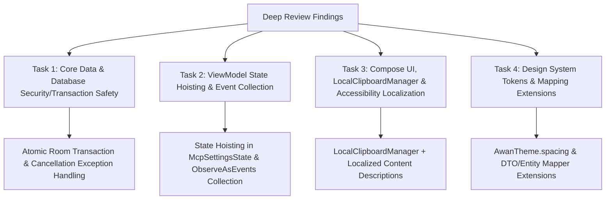

# MCP Integration Deep Review Remediation Plan

> **For agentic workers:** REQUIRED SUB-SKILL: Use superpowers:subagent-driven-development (recommended) or superpowers:executing-plans to implement this plan task-by-task. Steps use checkbox (`- [ ]`) syntax for tracking.

**Goal:** Resolve all 11 findings identified by `/deep-review` on branch `feature/AWAN-210-mcp-settings`, covering database transaction safety, raw token preservation on DB failure, ViewModel event collection, state hoisting, `LocalClipboardManager` adoption, accessibility localization, and Compose design system token compliance.

**Architecture:** Now in Android (NiA) Clean Architecture (`presentation → domain ← data`). Fixes touch `:core:database`, `:core:data`, `:feature:profile:api`, and `:feature:profile:impl`.

**Tech Stack:** Kotlin 2.4.0, Jetpack Compose BOM 2026.06.01, Compose Styles API, Room Database v2, Hilt DI, Navigation 3.

---

## Global Constraints

- **Branch:** Work on `feature/AWAN-210-mcp-settings`.
- **Clean Architecture:** ViewModels consume domain use cases ONLY. Repository interfaces stay in `:core:domain`.
- **Localization:** All user-facing strings and content descriptions must be localized in `strings.xml` (EN & AR) with `profile_mcp_*` prefix.
- **Styling:** Replace all hardcoded `16.dp`, `12.dp`, `8.dp`, `4.dp` with `AwanTheme.spacing` tokens (`spacing.xs`, `spacing.sm`, `spacing.md`, `spacing.lg`).
- **Security:** Ensure raw token returned by backend is NEVER lost due to local database cache failures, and display raw token strictly once in `CreatedTokenModal`.

---

## Plan Overview & Remediation Strategy



---

## Task Decomposition

### Task 1: Core Data & Database Security / Transaction Safety (Must Fix #1, #2, #4 & Consider #11)

**Files:**
- Modify: `core/database/src/main/kotlin/com/awan/app/core/database/dao/McpTokenDao.kt`
- Modify: `core/data/src/main/kotlin/com/awan/app/core/data/mcp/repository/McpRepositoryImpl.kt`
- Create: `core/data/src/main/kotlin/com/awan/app/core/data/mcp/mapper/McpMappers.kt`
- Modify: `core/data/src/test/java/com/awan/app/core/data/mcp/McpRepositoryImplTest.kt`

**Interfaces:**
- Consumes: `McpTokenDao`, `McpApiService`.
- Produces: Atomic transaction cache updates, non-blocking raw token delivery on local DB write failure, and re-thrown `CancellationException`.

- [ ] **Step 1: Add `@Transaction` atomic cache refresh function to `McpTokenDao.kt`**

```kotlin
@Dao
interface McpTokenDao {
    @Query("SELECT * FROM mcp_tokens ORDER BY createdAt DESC")
    fun getMcpTokens(): Flow<List<McpTokenEntity>>

    @Upsert
    suspend fun upsertMcpTokens(tokens: List<McpTokenEntity>)

    @Query("DELETE FROM mcp_tokens WHERE id = :id")
    suspend fun deleteMcpToken(id: String)

    @Query("DELETE FROM mcp_tokens")
    suspend fun clearAll()

    @Transaction
    suspend fun replaceMcpTokens(tokens: List<McpTokenEntity>) {
        clearAll()
        upsertMcpTokens(tokens)
    }
}
```

- [ ] **Step 2: Create DTO & Entity Mapper extension functions in `core/data/src/main/kotlin/com/awan/app/core/data/mcp/mapper/McpMappers.kt`**

```kotlin
fun McpTokenResponseDto.toEntity(): McpTokenEntity = McpTokenEntity(
    id = id,
    name = name,
    maskedToken = maskedToken,
    createdAt = createdAt,
    lastUsedAt = lastUsedAt
)

fun CreatedMcpTokenResponseDto.toEntity(): McpTokenEntity = McpTokenEntity(
    id = id,
    name = name,
    maskedToken = maskedToken,
    createdAt = createdAt,
    lastUsedAt = null
)

fun McpTokenEntity.toDomain(): McpToken = McpToken(
    id = id,
    name = name,
    maskedToken = maskedToken,
    createdAt = createdAt,
    lastUsedAt = lastUsedAt
)
```

- [ ] **Step 3: Fix `McpRepositoryImpl.kt` cache sync & raw token preservation**

1. Replace `clearAll()` + `upsertMcpTokens()` with atomic `mcpTokenDao.replaceMcpTokens(entities)`.
2. In `createMcpToken` and `regenerateMcpToken`, call API first to receive `CreatedMcpTokenResponseDto`. Then, attempt Room `upsertMcpTokens` inside a `try-catch`. If Room upsert fails, log/swallow the local cache error so that the returned `Result.Success(createdToken)` containing the one-time raw token is **never dropped**.
3. In catch blocks, re-throw `CancellationException`: `if (e is CancellationException) throw e`.

- [ ] **Step 4: Verify Repository Unit Tests**

```bash
./gradlew :core:data:testDebugUnitTest
```

- [ ] **Step 5: Commit Task 1**

```bash
git add core/database/ core/data/
git commit -m "AWAN-210: Fix Room atomic transaction, preserve one-time raw tokens on DB failure, and rethrow CancellationException"
```

---

### Task 2: ViewModel State Hoisting & Event Collection (Must Fix #3 & Should Fix #5)

**Files:**
- Modify: `feature/profile/impl/src/main/java/com/awan/feature/profile/impl/presentation/McpSettingsState.kt`
- Modify: `feature/profile/impl/src/main/java/com/awan/feature/profile/impl/presentation/McpSettingsAction.kt`
- Modify: `feature/profile/impl/src/main/java/com/awan/feature/profile/impl/presentation/McpSettingsViewModel.kt`
- Modify: `feature/profile/impl/src/main/java/com/awan/feature/profile/impl/navigation/McpSettingsRouteScreen.kt`
- Modify: `feature/profile/impl/src/test/java/com/awan/feature/profile/impl/presentation/McpSettingsViewModelTest.kt`

**Interfaces:**
- Consumes: `McpSettingsState`, `McpSettingsAction`, `McpSettingsViewModel`.
- Produces: Fully state-hoisted UI state flow (surviving configuration changes) and consumed event channel in `McpSettingsRouteScreen`.

- [ ] **Step 1: Hoist UI Dialog State into `McpSettingsState` and `McpSettingsAction`**

```kotlin
data class McpSettingsState(
    val connectionDetails: McpConnectionDetails? = null,
    val tokens: List<McpToken> = emptyList(),
    val createdToken: CreatedMcpToken? = null,
    val showAddTokenDialog: Boolean = false,
    val newTokenName: String = "",
    val deletingToken: McpToken? = null,
    val regeneratingToken: McpToken? = null,
    val isLoading: Boolean = false,
    val isCreating: Boolean = false,
    val userMessage: String? = null,
)

sealed interface McpSettingsAction {
    data object ShowAddTokenDialog : McpSettingsAction
    data object HideAddTokenDialog : McpSettingsAction
    data class UpdateNewTokenName(val name: String) : McpSettingsAction
    data class ShowDeleteDialog(val token: McpToken) : McpSettingsAction
    data object HideDeleteDialog : McpSettingsAction
    data class ShowRegenerateDialog(val token: McpToken) : McpSettingsAction
    data object HideRegenerateDialog : McpSettingsAction
    data class CreateToken(val name: String) : McpSettingsAction
    data class DeleteToken(val id: String) : McpSettingsAction
    data class RegenerateToken(val id: String) : McpSettingsAction
    data object DismissCreatedModal : McpSettingsAction
    data object DismissError : McpSettingsAction
    data object Refresh : McpSettingsAction
}
```

- [ ] **Step 2: Update `McpSettingsViewModel.kt` to handle new state hoisting actions**

- [ ] **Step 3: Collect ViewModel Events in `McpSettingsRouteScreen.kt`**

```kotlin
@Composable
fun McpSettingsRouteScreen(
    onNavigateToInfo: () -> Unit,
    onBack: () -> Unit,
    viewModel: McpSettingsViewModel = hiltViewModel(),
) {
    val uiState by viewModel.uiState.collectAsStateWithLifecycle()
    val context = LocalContext.current

    ObserveAsEvents(viewModel.events) { event ->
        when (event) {
            is McpSettingsEvent.Error -> {
                Toast.makeText(context, event.message, Toast.LENGTH_SHORT).show()
            }
            McpSettingsEvent.TokenCreated -> {}
            McpSettingsEvent.TokenDeleted -> {}
            McpSettingsEvent.TokenRegenerated -> {}
        }
    }

    McpSettingsScreen(
        uiState = uiState,
        onAction = viewModel::onAction,
        onInfoClick = onNavigateToInfo,
        onBackClick = onBack
    )
}
```

- [ ] **Step 4: Verify ViewModel Unit Tests**

```bash
./gradlew :feature:profile:impl:testDebugUnitTest --tests "com.awan.feature.profile.impl.presentation.McpSettingsViewModelTest"
```

- [ ] **Step 5: Commit Task 2**

```bash
git add feature/profile/impl/
git commit -m "AWAN-210: Hoist UI dialog state to ViewModel and collect events in McpSettingsRouteScreen"
```

---

### Task 3: Compose UI, LocalClipboardManager & Accessibility Localization (Should Fix #6, #7, #8, #9)

**Files:**
- Modify: `feature/profile/impl/src/main/res/values/strings.xml`
- Modify: `feature/profile/impl/src/main/res/values-ar/strings.xml`
- Modify: `feature/profile/impl/src/main/java/com/awan/feature/profile/impl/ui/McpSettingsScreen.kt`
- Modify: `feature/profile/impl/src/main/java/com/awan/feature/profile/impl/ui/McpInfoScreen.kt`
- Modify: `feature/profile/impl/src/main/java/com/awan/feature/profile/impl/ui/components/CreatedTokenModal.kt`

**Interfaces:**
- Consumes: Localized string resources, `LocalClipboardManager`.
- Produces: Accessible, localized Compose UI using native `LocalClipboardManager.current`.

- [ ] **Step 1: Add Localized Strings for Content Descriptions & Formatted Punctuation**

In `values/strings.xml`:
```xml
<string name="profile_mcp_cd_info">MCP Setup Info</string>
<string name="profile_mcp_cd_copy_url">Copy MCP Server URL</string>
<string name="profile_mcp_cd_copy_client_id">Copy OAuth Client ID</string>
<string name="profile_mcp_cd_copy_snippet">Copy Configuration Snippet</string>
<string name="profile_mcp_cd_delete_token">Delete Token %1$s</string>
<string name="profile_mcp_cd_regenerate_token">Regenerate Token %1$s</string>
<string name="profile_mcp_token_notice_formatted">%1$s. %2$s</string>
```

In `values-ar/strings.xml`:
```xml
<string name="profile_mcp_cd_info">معلومات إعداد MCP</string>
<string name="profile_mcp_cd_copy_url">نسخ رابط خادم MCP</string>
<string name="profile_mcp_cd_copy_client_id">نسخ معرف العميل</string>
<string name="profile_mcp_cd_copy_snippet">نسخ البرمجية النصية للتكوين</string>
<string name="profile_mcp_cd_delete_token">حذف الرمز %1$s</string>
<string name="profile_mcp_cd_regenerate_token">إعادة إنشاء الرمز %1$s</string>
<string name="profile_mcp_token_notice_formatted">%1$s. %2$s</string>
```

- [ ] **Step 2: Replace Context Clipboard with `LocalClipboardManager.current`**

In `CreatedTokenModal.kt`, `McpSettingsScreen.kt`, `McpInfoScreen.kt`:
```kotlin
val clipboardManager = LocalClipboardManager.current
// On copy click:
clipboardManager.setText(AnnotatedString(textToCopy))
```

- [ ] **Step 3: Update `McpSettingsScreen.kt` & `McpInfoScreen.kt` content descriptions & localized formatting**

- [ ] **Step 4: Commit Task 3**

```bash
git add feature/profile/impl/
git commit -m "AWAN-210: Use LocalClipboardManager, add localized content descriptions, and format string punctuation"
```

---

### Task 4: Design System Tokens & Component Refactoring (Consider #10)

**Files:**
- Modify: `feature/profile/impl/src/main/java/com/awan/feature/profile/impl/ui/McpSettingsScreen.kt`
- Modify: `feature/profile/impl/src/main/java/com/awan/feature/profile/impl/ui/McpInfoScreen.kt`
- Modify: `feature/profile/impl/src/main/java/com/awan/feature/profile/impl/ui/components/CreatedTokenModal.kt`

**Interfaces:**
- Consumes: `AwanTheme.spacing` tokens (`spacing.xs`, `spacing.sm`, `spacing.md`, `spacing.lg`), `AwanCard`.
- Produces: Design-system compliant composables without hardcoded pixel dimensions or manual card borders.

- [ ] **Step 1: Replace hardcoded `16.dp`, `12.dp`, `8.dp`, `4.dp` with `AwanTheme.spacing` tokens**
- Replace `16.dp` -> `AwanTheme.spacing.md`
- Replace `12.dp` -> `AwanTheme.spacing.sm` (or `spacing.md`)
- Replace `8.dp` -> `AwanTheme.spacing.xs`
- Replace `20.dp` -> `AwanTheme.spacing.lg`

- [ ] **Step 2: Refactor reinvented bordered boxes to use `AwanCard` / `AwanTheme` surfaces**

- [ ] **Step 3: Commit Task 4**

```bash
git add feature/profile/impl/
git commit -m "AWAN-210: Refactor MCP UI to use AwanTheme spacing tokens and AwanCard design components"
```

---

## Verification Plan

### Automated Tests
- Core Domain Unit Tests: `./gradlew :core:domain:testDebugUnitTest`
- Core Data Unit Tests: `./gradlew :core:data:testDebugUnitTest`
- Profile Feature Unit Tests: `./gradlew :feature:profile:impl:testDebugUnitTest`
- Full project build, tests & lint: `./gradlew assembleDebug testDebugUnitTest lint`

### Manual Verification
1. Open app, navigate to **Profile -> Settings -> MCP Integration**.
2. Rotate device on `McpSettingsScreen` while "Add Token" dialog is open or token name is typed: verify dialog and typed text survive rotation.
3. Test copying MCP URL, Client ID, raw token, and code snippets: verify toast appears and clipboard contains copied text via `LocalClipboardManager`.
4. Enable TalkBack / Accessibility inspector: verify all copy/info/action buttons announce localized content descriptions.
5. Trigger token creation: verify one-time raw token modal displays correctly with `AwanTheme.spacing` tokens.
