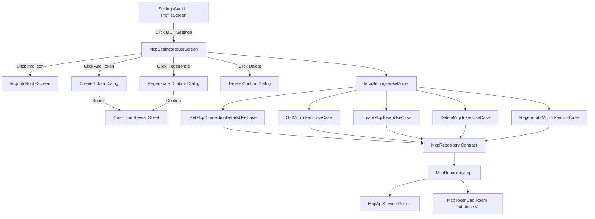

# MCP Integration & Token Management Implementation Plan

> **For agentic workers:** REQUIRED SUB-SKILL: Use superpowers:subagent-driven-development (recommended) or superpowers:executing-plans to implement this plan task-by-task. Steps use checkbox (`- [ ]`) syntax for tracking.

**Goal:** Add Model Context Protocol (MCP) integration to Awan, including MCP connection details, token management (Create, Delete, Regenerate) with one-time token reveal, and an interactive MCP setup info screen.

**Architecture:** Now in Android (NiA) architecture with Clean Architecture (`presentation → domain ← data`). Retrofit API endpoints in `:core:network`, Room DAO & caching in `:core:database`, offline-first `McpRepositoryImpl` in `:core:data`, use cases in `:core:domain`, and MVI screens (`McpSettingsScreen`, `McpInfoScreen`) in `:feature:profile`.

**Tech Stack:** Kotlin 2.4.0, Jetpack Compose BOM 2026.06.01, Compose Styles API, Navigation 3, Hilt DI, Retrofit + Kotlinx Serialization, Room database v2.

---

## Global Constraints

- **Git & Branching:** Create feature branch `feature/AWAN-210-mcp-settings` from `origin/develop`.
- **Clean Architecture:** ViewModels consume domain use cases ONLY (never repositories/DAOs directly). Repository interfaces live in `:core:domain`.
- **Localization:** All user-facing strings must be in `strings.xml` (both English `res/values/` and Arabic `res/values-ar/`).
- **Styling:** Jetpack Compose Styles API (`AwanTheme.colors`, `AwanTheme.styles`, `AwanTheme.spacing`), no hardcoded colors/dimensions.
- **Security:** Raw token is displayed ONLY ONCE in a secure modal/sheet upon creation/regeneration with a Copy button and warning. Token list rows show obscured/masked tokens and copy is disabled after initial creation.

---

## Plan Overview & Subsystems



---

## Task Decomposition

### Task 1: Feature Branch Creation & Strings Setup

**Files:**
- Modify: `Z:\Business\Awan\Awan-Android\feature\profile\impl\src\main\res\values\strings.xml`
- Modify: `Z:\Business\Awan\Awan-Android\feature\profile\impl\src\main\res\values-ar\strings.xml`

**Interfaces:**
- Consumes: User-approved feature branch `feature/AWAN-210-mcp-settings`.
- Produces: String resources for MCP settings, token management, dialogs, copy feedback, and setup instructions in EN & AR.

- [ ] **Step 1: Create git branch `feature/AWAN-210-mcp-settings` from `origin/develop`**

```bash
git checkout -b feature/AWAN-210-mcp-settings origin/develop
```

- [ ] **Step 2: Add MCP String resources in `res/values/strings.xml`**

```xml
<!-- MCP Settings Strings -->
<string name="profile_mcp_title">MCP Integration</string>
<string name="profile_mcp_subtitle">Connect AI assistants (Claude, Cursor) via Model Context Protocol</string>
<string name="profile_mcp_connection_title">Connection Details</string>
<string name="profile_mcp_url_label">MCP Server URL</string>
<string name="profile_mcp_client_id_label">OAuth Client ID</string>
<string name="profile_mcp_tokens_title">API Tokens</string>
<string name="profile_mcp_add_token">Add New Token</string>
<string name="profile_mcp_token_name_hint">Token Name (e.g. Claude Desktop)</string>
<string name="profile_mcp_token_obscured_notice">Token key is hidden for security</string>
<string name="profile_mcp_token_copy_disabled">Token can only be copied when initially created</string>
<string name="profile_mcp_token_created_banner_title">Token Created Successfully!</string>
<string name="profile_mcp_token_created_banner_warning">Make sure to copy your personal access token now. You won’t be able to see it again!</string>
<string name="profile_mcp_token_copy">Copy Token</string>
<string name="profile_mcp_token_copied">Token copied to clipboard</string>
<string name="profile_mcp_token_delete_confirm_title">Delete Token?</string>
<string name="profile_mcp_token_delete_confirm_body">Are you sure you want to delete this MCP token? AI assistants using this token will lose access immediately.</string>
<string name="profile_mcp_token_regenerate_confirm_title">Regenerate Token?</string>
<string name="profile_mcp_token_regenerate_confirm_body">Regenerating this token will revoke the existing key. Any connected agent will need the new token.</string>
<string name="profile_mcp_info_title">How to Connect your AI Assistant</string>
<string name="profile_mcp_info_step1">1. Copy the MCP Server URL and Client ID above.</string>
<string name="profile_mcp_info_step2">2. Create an API Token and copy the key immediately.</string>
<string name="profile_mcp_info_step3">3. Paste the configuration into your assistant (e.g. claude_desktop_config.json).</string>
```

- [ ] **Step 3: Add corresponding Arabic strings in `res/values-ar/strings.xml`**

```xml
<string name="profile_mcp_title">تكامل MCP</string>
<string name="profile_mcp_subtitle">ربط المساعدين الذكيين (Claude, Cursor) عبر بروتوكول MCP</string>
<string name="profile_mcp_connection_title">تفاصيل الاتصال</string>
<string name="profile_mcp_url_label">رابط خادم MCP</string>
<string name="profile_mcp_client_id_label">معرف العميل (Client ID)</string>
<string name="profile_mcp_tokens_title">رموز الوصول (Tokens)</string>
<string name="profile_mcp_add_token">إضافة رمز جديد</string>
<string name="profile_mcp_token_name_hint">اسم الرمز (مثال: Claude Desktop)</string>
<string name="profile_mcp_token_obscured_notice">تم إخفاء المفتاح لأسباب أمنية</string>
<string name="profile_mcp_token_copy_disabled">يمكن نسخ الرمز فقط عند إنشائه لأول مرة</string>
<string name="profile_mcp_token_created_banner_title">تم إنشاء الرمز بنجاح!</string>
<string name="profile_mcp_token_created_banner_warning">احرص على نسخ رمز الوصول الخاص بك الآن. لن تتمكن من رؤيته مرة أخرى!</string>
<string name="profile_mcp_token_copy">نسخ الرمز</string>
<string name="profile_mcp_token_copied">تم نسخ الرمز إلى الحافظة</string>
<string name="profile_mcp_token_delete_confirm_title">حذف الرمز؟</string>
<string name="profile_mcp_token_delete_confirm_body">هل أنت تأكد من حذف رمز MCP هذا؟ سيفقد المساعد الذكي الوصول فوراً.</string>
<string name="profile_mcp_token_regenerate_confirm_title">إعادة إنشاء الرمز؟</string>
<string name="profile_mcp_token_regenerate_confirm_body">إعادة إنشاء الرمز ستلغي المفتاح الحالي. ستحتاج إلى تحديثه في المساعد الذكي.</string>
<string name="profile_mcp_info_title">كيفية ربط مساعدك الذكي</string>
<string name="profile_mcp_info_step1">1. انسخ رابط خادم MCP ومعرف العميل أعلاه.</string>
<string name="profile_mcp_info_step2">2. أنشئ رمز وصول واحفظ المفتاح فوراً.</string>
<string name="profile_mcp_info_step3">3. قم بتضمين الإعدادات في ملف التكوين (مثل claude_desktop_config.json).</string>
```

- [ ] **Step 4: Commit Task 1**

```bash
git add feature/profile/impl/src/main/res/values/strings.xml feature/profile/impl/src/main/res/values-ar/strings.xml
git commit -m "AWAN-210: Add localized string resources for MCP settings and token management"
```

---

### Task 2: Core Domain Layer (`:core:domain`)

**Files:**
- Create: `core/domain/src/main/kotlin/com/awan/app/core/domain/mcp/model/McpConnectionDetails.kt`
- Create: `core/domain/src/main/kotlin/com/awan/app/core/domain/mcp/model/McpToken.kt`
- Create: `core/domain/src/main/kotlin/com/awan/app/core/domain/mcp/model/CreatedMcpToken.kt`
- Create: `core/domain/src/main/kotlin/com/awan/app/core/domain/mcp/repository/McpRepository.kt`
- Create: `core/domain/src/main/kotlin/com/awan/app/core/domain/mcp/usecase/GetMcpConnectionDetailsUseCase.kt`
- Create: `core/domain/src/main/kotlin/com/awan/app/core/domain/mcp/usecase/GetMcpTokensUseCase.kt`
- Create: `core/domain/src/main/kotlin/com/awan/app/core/domain/mcp/usecase/CreateMcpTokenUseCase.kt`
- Create: `core/domain/src/main/kotlin/com/awan/app/core/domain/mcp/usecase/DeleteMcpTokenUseCase.kt`
- Create: `core/domain/src/main/kotlin/com/awan/app/core/domain/mcp/usecase/RegenerateMcpTokenUseCase.kt`
- Test: `core/domain/src/test/kotlin/com/awan/app/core/domain/mcp/usecase/McpUseCasesTest.kt`

**Interfaces:**
- Consumes: `:core:common` (`Result`, `AppError`).
- Produces: `McpRepository` contract and use cases consumed by `McpSettingsViewModel`.

- [ ] **Step 1: Write Unit Test for Use Cases**

```kotlin
class McpUseCasesTest {
    private val fakeRepository = FakeMcpRepository()
    private val getTokensUseCase = GetMcpTokensUseCase(fakeRepository)
    private val createTokenUseCase = CreateMcpTokenUseCase(fakeRepository)

    @Test
    fun `createMcpToken returns created token`() = runTest {
        val result = createTokenUseCase("Claude Desktop")
        assertThat(result).isInstanceOf<Result.Success<CreatedMcpToken>>()
    }
}
```

- [ ] **Step 2: Create Domain Models & Repository Interface**

```kotlin
data class McpConnectionDetails(
    val mcpUrl: String,
    val clientId: String
)

data class McpToken(
    val id: String,
    val name: String,
    val maskedToken: String,
    val createdAt: String,
    val lastUsedAt: String? = null
)

data class CreatedMcpToken(
    val id: String,
    val name: String,
    val rawToken: String,
    val maskedToken: String,
    val createdAt: String
)

interface McpRepository {
    fun getMcpConnectionDetails(): Flow<Result<McpConnectionDetails>>
    fun getMcpTokens(): Flow<Result<List<McpToken>>>
    suspend fun createMcpToken(name: String): Result<CreatedMcpToken>
    suspend fun deleteMcpToken(id: String): Result<Unit>
    suspend fun regenerateMcpToken(id: String): Result<CreatedMcpToken>
}
```

- [ ] **Step 3: Create Use Cases**

```kotlin
class GetMcpConnectionDetailsUseCase @Inject constructor(
    private val repository: McpRepository
) {
    operator fun invoke(): Flow<Result<McpConnectionDetails>> = repository.getMcpConnectionDetails()
}

class GetMcpTokensUseCase @Inject constructor(
    private val repository: McpRepository
) {
    operator fun invoke(): Flow<Result<List<McpToken>>> = repository.getMcpTokens()
}

class CreateMcpTokenUseCase @Inject constructor(
    private val repository: McpRepository
) {
    suspend operator fun invoke(name: String): Result<CreatedMcpToken> = repository.createMcpToken(name)
}

class DeleteMcpTokenUseCase @Inject constructor(
    private val repository: McpRepository
) {
    suspend operator fun invoke(id: String): Result<Unit> = repository.deleteMcpToken(id)
}

class RegenerateMcpTokenUseCase @Inject constructor(
    private val repository: McpRepository
) {
    suspend operator fun invoke(id: String): Result<CreatedMcpToken> = repository.regenerateMcpToken(id)
}
```

- [ ] **Step 4: Verify Unit Tests Pass**

```bash
./gradlew :core:domain:testDebugUnitTest
```

- [ ] **Step 5: Commit Task 2**

```bash
git add core/domain/
git commit -m "AWAN-210: Add MCP domain models, repository contract, and use cases"
```

---

### Task 3: Core Network & Database Layer (`:core:network`, `:core:database`, `:core:data`)

**Files:**
- Create: `core/network/src/main/kotlin/com/awan/app/core/network/dto/mcp/McpConnectionDetailsDto.kt`
- Create: `core/network/src/main/kotlin/com/awan/app/core/network/dto/mcp/McpTokenResponseDto.kt`
- Create: `core/network/src/main/kotlin/com/awan/app/core/network/dto/mcp/CreateMcpTokenRequestDto.kt`
- Create: `core/network/src/main/kotlin/com/awan/app/core/network/dto/mcp/CreatedMcpTokenResponseDto.kt`
- Create: `core/network/src/main/kotlin/com/awan/app/core/network/api/McpApiService.kt`
- Create: `core/database/src/main/kotlin/com/awan/app/core/database/model/McpTokenEntity.kt`
- Create: `core/database/src/main/kotlin/com/awan/app/core/database/dao/McpTokenDao.kt`
- Modify: `core/database/src/main/kotlin/com/awan/app/core/database/AwanDatabase.kt` (v1 -> v2 migration)
- Create: `core/data/src/main/kotlin/com/awan/app/core/data/mcp/repository/McpRepositoryImpl.kt`
- Create: `core/data/src/main/kotlin/com/awan/app/core/data/mcp/di/McpDataModule.kt`
- Test: `core/data/src/test/kotlin/com/awan/app/core/data/mcp/McpRepositoryImplTest.kt`

**Interfaces:**
- Consumes: `:core:network`, `:core:database`.
- Produces: `McpRepositoryImpl` bound to `McpRepository` via Hilt `@Binds`.

- [ ] **Step 1: Create Network DTOs & McpApiService Interface**

```kotlin
@Serializable
data class McpConnectionDetailsDto(
    @SerialName("mcpUrl") val mcpUrl: String,
    @SerialName("clientId") val clientId: String
)

@Serializable
data class McpTokenResponseDto(
    @SerialName("id") val id: String,
    @SerialName("name") val name: String,
    @SerialName("maskedToken") val maskedToken: String,
    @SerialName("createdAt") val createdAt: String,
    @SerialName("lastUsedAt") val lastUsedAt: String? = null
)

@Serializable
data class CreateMcpTokenRequestDto(
    @SerialName("name") val name: String
)

@Serializable
data class CreatedMcpTokenResponseDto(
    @SerialName("id") val id: String,
    @SerialName("name") val name: String,
    @SerialName("rawToken") val rawToken: String,
    @SerialName("maskedToken") val maskedToken: String,
    @SerialName("createdAt") val createdAt: String
)

interface McpApiService {
    @GET("v1/mcp/settings/connection-details")
    suspend fun getConnectionDetails(): McpConnectionDetailsDto

    @GET("v1/mcp/tokens")
    suspend fun getTokens(): List<McpTokenResponseDto>

    @POST("v1/mcp/tokens")
    suspend fun createToken(@Body request: CreateMcpTokenRequestDto): CreatedMcpTokenResponseDto

    @DELETE("v1/mcp/tokens/{id}")
    suspend fun deleteToken(@Path("id") id: String)

    @POST("v1/mcp/tokens/{id}/regenerate")
    suspend fun regenerateToken(@Path("id") id: String): CreatedMcpTokenResponseDto
}
```

- [ ] **Step 2: Create Database Entity & DAO**

```kotlin
@Entity(tableName = "mcp_tokens")
data class McpTokenEntity(
    @PrimaryKey val id: String,
    val name: String,
    val maskedToken: String,
    val createdAt: String,
    val lastUsedAt: String? = null
)

@Dao
interface McpTokenDao {
    @Query("SELECT * FROM mcp_tokens ORDER BY createdAt DESC")
    fun getMcpTokens(): Flow<List<McpTokenEntity>>

    @Upsert
    suspend fun upsertMcpTokens(tokens: List<McpTokenEntity>)

    @Query("DELETE FROM mcp_tokens WHERE id = :id")
    suspend fun deleteMcpToken(id: String)

    @Query("DELETE FROM mcp_tokens")
    suspend fun clearAll()
}
```

- [ ] **Step 3: Update AwanDatabase & Migration v1 -> v2**

```kotlin
val MIGRATION_1_2 = object : Migration(1, 2) {
    override fun migrate(db: SupportSQLiteDatabase) {
        db.execSQL(
            """
            CREATE TABLE IF NOT EXISTS `mcp_tokens` (
                `id` TEXT NOT NULL,
                `name` TEXT NOT NULL,
                `maskedToken` TEXT NOT NULL,
                `createdAt` TEXT NOT NULL,
                `lastUsedAt` TEXT,
                PRIMARY KEY(`id`)
            )
            """.trimIndent()
        )
    }
}
```

- [ ] **Step 4: Implement McpRepositoryImpl with Offline-First DAO + Remote Sync & Network Error Handling**

- [ ] **Step 5: Verify Repository Unit Tests**

```bash
./gradlew :core:data:testDebugUnitTest
```

- [ ] **Step 6: Commit Task 3**

```bash
git add core/network/ core/database/ core/data/
git commit -m "AWAN-210: Add MCP network DTOs, Room entity/DAO, Room migration v1->v2, and McpRepositoryImpl"
```

---

### Task 4: UI Presentation Layer (`:feature:profile`)

**Files:**
- Create: `feature/profile/api/src/main/java/com/awan/feature/profile/api/McpSettingsRoute.kt`
- Create: `feature/profile/api/src/main/java/com/awan/feature/profile/api/McpInfoRoute.kt`
- Create: `feature/profile/impl/src/main/java/com/awan/feature/profile/impl/presentation/McpSettingsState.kt`
- Create: `feature/profile/impl/src/main/java/com/awan/feature/profile/impl/presentation/McpSettingsAction.kt`
- Create: `feature/profile/impl/src/main/java/com/awan/feature/profile/impl/presentation/McpSettingsEvent.kt`
- Create: `feature/profile/impl/src/main/java/com/awan/feature/profile/impl/presentation/McpSettingsViewModel.kt`
- Create: `feature/profile/impl/src/main/java/com/awan/feature/profile/impl/ui/McpSettingsScreen.kt`
- Create: `feature/profile/impl/src/main/java/com/awan/feature/profile/impl/ui/McpInfoScreen.kt`
- Create: `feature/profile/impl/src/main/java/com/awan/feature/profile/impl/ui/components/CreatedTokenModal.kt`
- Test: `feature/profile/impl/src/test/java/com/awan/feature/profile/impl/presentation/McpSettingsViewModelTest.kt`

**Interfaces:**
- Consumes: `:core:domain` use cases (`GetMcpConnectionDetailsUseCase`, `GetMcpTokensUseCase`, `CreateMcpTokenUseCase`, `DeleteMcpTokenUseCase`, `RegenerateMcpTokenUseCase`).
- Produces: `McpSettingsScreen` UI and `McpInfoScreen` UI.

- [ ] **Step 1: Create Routes in `:feature:profile:api`**

```kotlin
@Serializable
data object McpSettingsRoute : Route

@Serializable
data object McpInfoRoute : Route
```

- [ ] **Step 2: Create ViewModel, State, Action & Event**

- State holds `connectionDetails`, `tokens`, `createdToken` (non-null triggers modal), `isLoading`, `isCreating`, `userMessage`.
- ViewModel manages creating, deleting, regenerating tokens and exposing UI state.

- [ ] **Step 3: Write ViewModel Unit Test**

```bash
./gradlew :feature:profile:impl:testDebugUnitTest --tests "com.awan.feature.profile.impl.presentation.McpSettingsViewModelTest"
```

- [ ] **Step 4: Build `CreatedTokenModal` (One-Time Reveal Sheet/Dialog)**
- Monospaced text box displaying raw token.
- Copy button with clipboard manager toast/snackbar.
- High-visibility security warning notice banner.

- [ ] **Step 5: Build `McpSettingsScreen` & `McpInfoScreen` Composables**
- Jetpack Compose Styles API (`AwanTheme`, `AwanCard`, `AwanButton`, `AwanText`, `AwanTextField`).
- Info button in top bar navigating to `McpInfoRoute`.

- [ ] **Step 6: Commit Task 4**

```bash
git add feature/profile/
git commit -m "AWAN-210: Add MCP settings state, ViewModel, McpSettingsScreen, McpInfoScreen, and CreatedTokenModal"
```

---

### Task 5: Navigation Wiring & Profile Integration

**Files:**
- Modify: `feature/profile/impl/src/main/java/com/awan/feature/profile/impl/ui/components/SettingsCard.kt`
- Modify: `feature/profile/impl/src/main/java/com/awan/feature/profile/impl/navigation/ProfileEntryProvider.kt`
- Modify: `app/src/main/java/com/awan/app/AwanApp.kt`

**Interfaces:**
- Consumes: `McpSettingsRoute`, `McpInfoRoute`, `profileEntry`.
- Produces: Complete end-to-end user navigation flow from Profile -> SettingsCard -> MCP Settings -> MCP Info.

- [ ] **Step 1: Add "MCP Integration" row in `SettingsCard.kt`**

```kotlin
PreferenceRow(
    icon = Icons.Default.VpnKey, // or Key/Extension
    title = stringResource(ProfileR.string.profile_mcp_title),
    onClick = { onSettingsClick("mcp") },
    showDivider = true,
    iconColor = AwanTheme.colors.primary
)
```

- [ ] **Step 2: Wire `McpSettingsRoute` and `McpInfoRoute` entries in `ProfileEntryProvider.kt`**

```kotlin
entry<McpSettingsRoute> {
    McpSettingsRouteScreen(
        onNavigateToInfo = { navigator.navigate(McpInfoRoute) },
        onBack = onBack
    )
}

entry<McpInfoRoute> {
    McpInfoRouteScreen(
        onBack = onBack
    )
}
```

- [ ] **Step 3: Update `AwanApp.kt` `profileEntry` handler**

```kotlin
onNavigateToMcpSettings = { navigator.navigate(McpSettingsRoute) }
```

- [ ] **Step 4: Verify Full App Build & Unit Tests**

```bash
./gradlew assembleDebug testDebugUnitTest
```

- [ ] **Step 5: Commit Task 5**

```bash
git add feature/profile/ app/
git commit -m "AWAN-210: Integrate MCP Settings and Info screen navigation into Profile module and AwanApp"
```

---

## Verification Plan

### Automated Tests
- Unit Tests for Domain Use Cases: `./gradlew :core:domain:testDebugUnitTest`
- Unit Tests for Repository & Data Layer: `./gradlew :core:data:testDebugUnitTest`
- Unit Tests for McpSettingsViewModel: `./gradlew :feature:profile:impl:testDebugUnitTest`
- Full project clean build & unit tests: `./gradlew assembleDebug testDebugUnitTest`

### Manual Verification
1. Launch app and navigate to **Profile** tab.
2. Verify "MCP Integration" item appears under **Settings**.
3. Click "MCP Integration" and verify navigation to `McpSettingsScreen`.
4. Verify MCP Server URL (`mcpUrl`) and Client ID (`clientId`) display correctly with copy buttons.
5. Click **Info Icon** in top bar, verify navigation to `McpInfoScreen` with step-by-step setup guides.
6. Return to MCP Settings, click **Add New Token**, type token name "Claude Desktop".
7. Verify **One-Time Token Modal** appears displaying the raw token, Copy button, and security warning banner.
8. Copy token and close modal. Verify token appears in token list as obscured (`••••••••token_suffix`).
9. Verify token list row Copy button is disabled/greyed out with prompt explaining copy is only available during creation.
10. Click **Regenerate**, confirm dialog, verify new raw token modal appears.
11. Click **Delete**, confirm dialog, verify token is removed from list.
