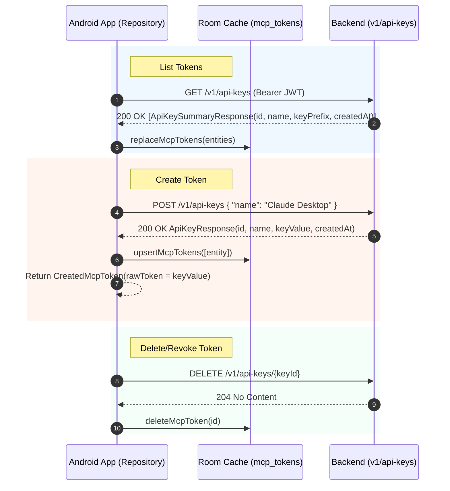

# MCP Integration Postman API Migration Plan

> **For agentic workers:** REQUIRED SUB-SKILL: Use superpowers:subagent-driven-development (recommended) or superpowers:executing-plans to implement this plan task-by-task. Steps use checkbox (`- [ ]`) syntax for tracking.

**Goal:** Replace placeholder `/v1/mcp/tokens` and `/v1/mcp/settings/connection-details` API endpoints with the official Postman backend endpoints from the **Awan** collection (**API Keys** folder):
- `GET v1/api-keys`: List active API keys (`id`, `name`, `keyPrefix`, `createdAt`).
- `POST v1/api-keys`: Create new API key (`id`, `name`, `keyValue`, `createdAt`).
- `DELETE v1/api-keys/{keyId}`: Revoke API key (204 No Content).
- Static Server Connection Details (`https://backend-production-c701.up.railway.app/api/v1/mcp`).

**Architecture:** Now in Android (NiA) Clean Architecture (`presentation → domain ← data`). Fixes touch `:core:network`, `:core:database`, `:core:data`, `:core:domain`, and `:feature:profile:impl`.

---

## Postman API Contract Alignment



---

## Proposed Changes

### Core Network Layer (`:core:network`)

#### [MODIFY] `McpApiService.kt`
Replace fake endpoints with official `/v1/api-keys` endpoints:

```kotlin
interface McpApiService {
    @GET("v1/api-keys")
    suspend fun getApiKeys(): Response<List<ApiKeySummaryDto>>

    @POST("v1/api-keys")
    suspend fun createApiKey(@Body request: CreateApiKeyRequestDto): Response<ApiKeyResponseDto>

    @DELETE("v1/api-keys/{keyId}")
    suspend fun revokeApiKey(@Path("keyId") keyId: String): Response<Unit>
}
```

#### [NEW] `ApiKeySummaryDto.kt`, `CreateApiKeyRequestDto.kt`, `ApiKeyResponseDto.kt`
Define network DTOs matching Postman specs exactly:

```kotlin
@Serializable
data class ApiKeySummaryDto(
    @SerialName("id") val id: String,
    @SerialName("name") val name: String,
    @SerialName("keyPrefix") val keyPrefix: String,
    @SerialName("createdAt") val createdAt: String,
)

@Serializable
data class CreateApiKeyRequestDto(
    @SerialName("name") val name: String,
)

@Serializable
data class ApiKeyResponseDto(
    @SerialName("id") val id: String,
    @SerialName("name") val name: String,
    @SerialName("keyValue") val keyValue: String,
    @SerialName("createdAt") val createdAt: String,
)
```

---

### Core Data & Database Layer (`:core:data` & `:core:database`)

#### [MODIFY] `McpMappers.kt`
Map `ApiKeySummaryDto` and `ApiKeyResponseDto` to `McpTokenEntity` & domain `McpToken`:

```kotlin
fun ApiKeySummaryDto.toEntity(): McpTokenEntity = McpTokenEntity(
    id = id,
    name = name,
    maskedToken = keyPrefix,
    createdAt = createdAt,
    lastUsedAt = null
)

fun ApiKeyResponseDto.toDomain(): CreatedMcpToken = CreatedMcpToken(
    id = id,
    name = name,
    rawToken = keyValue,
    maskedToken = if (keyValue.length >= 12) keyValue.take(12) + "..." else keyValue,
    createdAt = createdAt
)
```

#### [MODIFY] `McpRepositoryImpl.kt`
1. `getMcpConnectionDetails()`: Provide static connection details without making non-existent network calls:
   `McpConnectionDetails(mcpUrl = "https://backend-production-c701.up.railway.app/api/v1/mcp", clientId = "awan-android-client")`
2. `getMcpTokens()`: Execute `mcpApiService.getApiKeys()`, map DTOs to entities, and call atomic `replaceMcpTokens`.
3. `createMcpToken(name)`: Call `mcpApiService.createApiKey(CreateApiKeyRequestDto(name = name))`.
4. `deleteMcpToken(id)`: Call `mcpApiService.revokeApiKey(id)`.
5. `regenerateMcpToken(id)`: Call `createApiKey` with the existing token name, then call `revokeApiKey(id)`.

---

## Verification Plan

### Automated Tests
- Core Network & Data Unit Tests: `./gradlew :core:network:testDebugUnitTest :core:data:testDebugUnitTest`
- Feature Profile Unit Tests: `./gradlew :feature:profile:impl:testDebugUnitTest`
- Full project build & lint: `./gradlew assembleDebug testDebugUnitTest lint`

### Manual Verification
1. Run app on device/emulator.
2. Navigate to **Profile -> Settings -> MCP Integration**.
3. Verify `GET v1/api-keys` returns HTTP 200 (instead of 500) and displays token list or empty state.
4. Verify `POST v1/api-keys` creates key and returns `keyValue` in `CreatedTokenModal`.
5. Verify `DELETE v1/api-keys/{id}` revokes key with HTTP 204.
