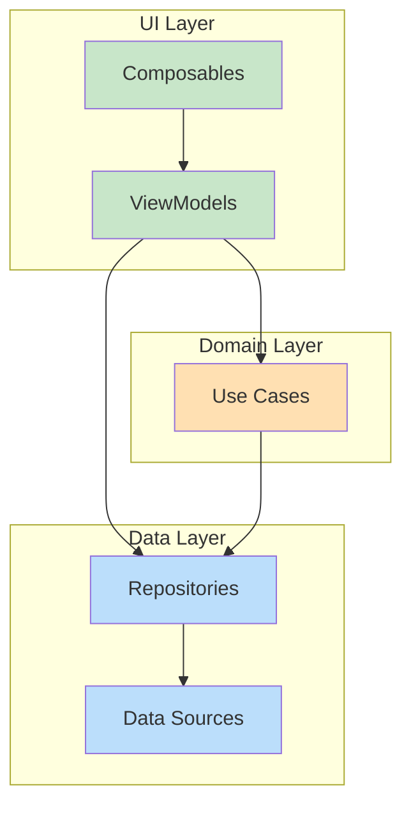
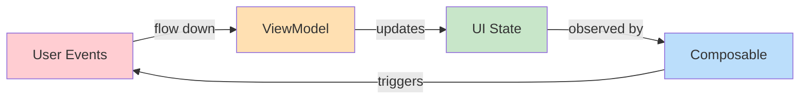
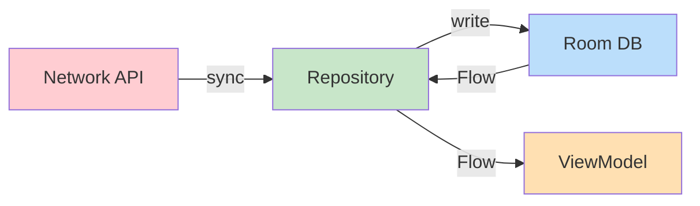

# Chapter 1 — Project Overview

## Why Google Created This Project

Now in Android (NiA) exists for one reason: **to demonstrate how Google itself recommends building Android apps**. Before NiA, the Android team published architecture guidance as text articles and small samples. Developers kept asking: *"Show us a real app that does it all together."*

NiA answers that question. It is a production-grade application — not a toy — that aggregates Android development news, lets users follow topics, bookmark articles, and receive notifications. Every architectural choice exists to model what a team of 5–50 engineers would need when building a large-scale app.

---

## What Problems It Solves

| Problem | NiA's Solution |
|---------|---------------|
| No canonical full-app reference | NiA is that reference |
| Unclear module boundaries in large apps | Strict feature + core modularization |
| Tight coupling between features | Feature `api/impl` split with dependency inversion |
| Offline support is an afterthought | Offline-first architecture from day one |
| UI tightly coupled to data fetching | Unidirectional Data Flow separates concerns |
| Build times grow with codebase | Convention plugins + granular modules keep builds fast |
| Testing is bolted on | Testing infrastructure built into architecture |

---

## Target Architecture

NiA follows the [official Android architecture guidance](https://developer.android.com/topic/architecture) with three distinct layers:

> **Important:** This is the *official* Android architecture, not "Clean Architecture" as defined by Uncle Bob. Concepts like entities, interactors, and gateways from Clean Architecture do not directly map here. [Discussion](https://github.com/android/nowinandroid/discussions/1273).

---

## Main Technologies

| Technology | Role | Why This Choice |
|---|---|---|
| **Kotlin** | Language | First-class Android language with coroutines, Flow, sealed classes |
| **Jetpack Compose** | UI | Declarative UI eliminates View system boilerplate |
| **Material 3** | Design system | Latest Material spec with dynamic color |
| **Navigation 3** | Navigation | Type-safe, composable navigation with `NavKey` |
| **Hilt** | DI | Convention-based, Android-lifecycle-aware DI |
| **Room** | Database | Type-safe SQL with Flow integration |
| **Proto DataStore** | Preferences | Type-safe, async preferences backed by Protocol Buffers |
| **Retrofit + OkHttp** | Network | Industry standard for REST APIs |
| **WorkManager** | Background | Guaranteed, constraint-aware background work |
| **Kotlin Serialization** | Serialization | Multiplatform-ready serialization for nav keys and network models |

---

## Architectural Principles

### 1. Layer Separation

Each layer has clear boundaries:

- **UI layer** knows about domain and data interfaces, never about implementations.
- **Domain layer** contains business logic independent of Android framework.
- **Data layer** abstracts all data sources behind repository interfaces.

### 2. Feature Modularization

Every user-facing feature lives in its own Gradle module split into:
- `api` — Contains the `NavKey` definition (the "contract" other features use to navigate here)
- `impl` — Contains the Screen, ViewModel, and entry provider

### 3. Unidirectional Data Flow (UDF)

- Events (user actions) flow **down** from UI to ViewModel
- State flows **up** from ViewModel to UI
- UI never mutates state directly

### 4. Reactive Programming

All data is exposed as `Flow` streams. No snapshot reads (`getModel()`). The UI subscribes to state and re-renders when new data arrives. This guarantees the UI always reflects the current source of truth.

### 5. Offline-First Philosophy

Local storage (Room) is the **single source of truth**. Network is a sync mechanism, not a primary data source.

**Why offline-first:**
- Users should see content immediately, even without internet
- Network calls can fail; local data never does
- Separates read and write concerns

### 6. Scalability Goals

- Module boundaries prevent one team's changes from breaking another's
- Convention plugins ensure every module is configured identically
- Build parallelism improves with more modules
- Feature `api/impl` split prevents feature-to-feature coupling

### 7. Testability Goals

- Repository interfaces allow easy faking in tests
- ViewModels are tested with fake repositories and Turbine for Flow assertions
- Composables are tested with `ComposeTestRule`
- The `core:testing` module provides shared test infrastructure

---

## Summary

Now in Android is Google's reference for building large-scale Android apps. It demonstrates layer separation, feature modularization, offline-first data, reactive programming, and unidirectional data flow — all with production-grade tooling.

## Key Takeaways

- NiA follows official Android architecture guidance, not "Clean Architecture"
- Three layers: UI, Domain (optional), Data
- Data flows up as `Flow` streams; events flow down as function calls
- Offline-first means Room is the source of truth, network syncs in the background
- Each feature is its own module with `api/impl` separation

## Best Practices

- Always expose data as `Flow`, never as snapshots
- Keep ViewModels free of Android framework imports (except `ViewModel` itself)
- Use convention plugins so every module is configured consistently
- Split features into `api` (navigation contract) and `impl` (everything else)

## Common Mistakes

- **Reading data from network directly in ViewModel** — Always go through a Repository
- **Using `LiveData` instead of `StateFlow`** — NiA uses `StateFlow` exclusively
- **Putting business logic in Composables** — Keep it in ViewModels or Use Cases
- **Creating circular module dependencies** — Features should never depend on other feature `impl` modules
