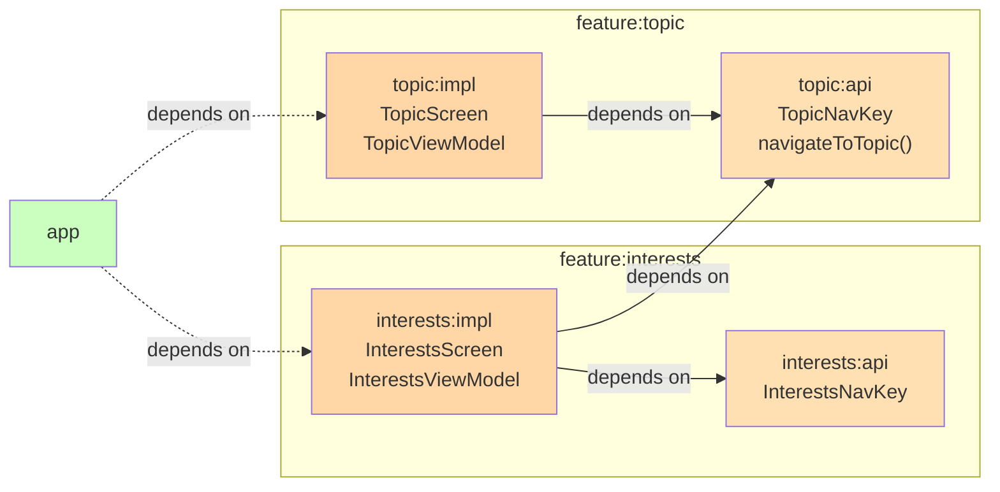
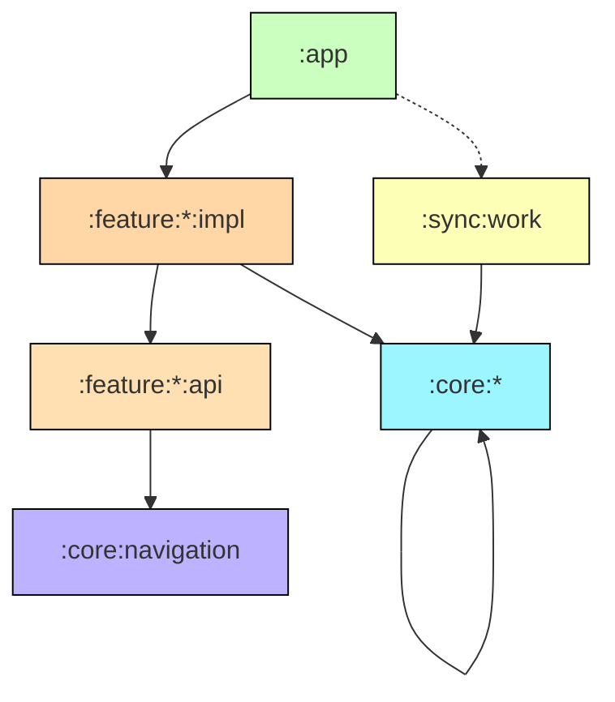

# Chapter 2 — Project Structure

## Overview

The Now in Android repository follows a **multi-module** structure where code is organized by **responsibility**, not by layer. Each folder at the root level has a distinct purpose, and understanding the folder structure is the first step to navigating the codebase.

```
nowinandroid/
├── app/                    # Application module — entry point
├── app-nia-catalog/        # Design system catalog app
├── benchmarks/             # Macrobenchmark tests
├── build-logic/            # Gradle convention plugins
├── core/                   # Shared library modules
│   ├── analytics/
│   ├── common/
│   ├── data/
│   ├── data-test/
│   ├── database/
│   ├── datastore/
│   ├── datastore-proto/
│   ├── datastore-test/
│   ├── designsystem/
│   ├── domain/
│   ├── model/
│   ├── navigation/
│   ├── network/
│   ├── notifications/
│   ├── screenshot-testing/
│   ├── testing/
│   └── ui/
├── feature/                # Feature modules
│   ├── bookmarks/  (api + impl)
│   ├── foryou/     (api + impl)
│   ├── interests/  (api + impl)
│   ├── search/     (api + impl)
│   ├── settings/   (impl only)
│   └── topic/      (api + impl)
├── lint/                   # Custom lint rules
├── sync/                   # Data synchronization
│   ├── work/
│   └── sync-test/
├── ui-test-hilt-manifest/  # Test manifest for Hilt UI tests
├── docs/                   # Documentation
├── gradle/                 # Gradle wrapper + version catalog
└── build-logic/            # Composite build for convention plugins
```

---

## Folder-by-Folder Explanation

### `app/`

**Purpose:** The application module. This is the only module that produces an APK.

**Contains:**
- `MainActivity` — Single activity, entry point for the app
- `MainActivityViewModel` — Manages splash screen state and theme
- `NiaApp` — Root composable: scaffold, navigation suite, top app bar
- `NiaAppState` — Centralized app state holder (network status, current timezone, unread badges)
- `TopLevelNavItem` — Defines bottom navigation items
- `NiaApplication` — Application class with Hilt setup

**Why it exists:** Android requires exactly one application module to produce an installable artifact. All feature and core modules feed into this one.

**Dependency rule:** `app` depends on all `feature:*:impl` modules and selected `core` modules. No other module depends on `app`.

---

### `feature/`

**Purpose:** Contains all user-facing features, each in its own module.

**Structure:** Every feature (except settings) is split into two submodules:

| Submodule | Contains | Example |
|---|---|---|
| `api` | `NavKey` definition, navigation extension functions | `ForYouNavKey`, `navigateToTopic()` |
| `impl` | Screen composables, ViewModel, entry provider | `ForYouScreen`, `ForYouViewModel`, `forYouEntry()` |

**Why the `api/impl` split:**
- Feature A can navigate to Feature B by depending on B's `api` module
- Feature A never needs B's `impl` — no access to B's ViewModel or Screen internals
- Prevents transitive dependency chains between features
- Enables parallel compilation of feature `impl` modules



**Features in the project:**

| Feature | Has API? | Description |
|---------|----------|-------------|
| `foryou` | Yes | Main feed showing personalized news |
| `bookmarks` | Yes | Saved/bookmarked articles |
| `interests` | Yes | Topic browsing with list-detail layout |
| `topic` | Yes | Single topic detail page |
| `search` | Yes | Full-text search across content |
| `settings` | No | Settings dialog (no cross-feature navigation needed) |

---

### `core/`

**Purpose:** Shared library modules that feature modules and the app module depend on.

**Key rule:** Core modules may depend on other core modules but **never** on feature modules or the app module.

Detailed breakdown (see [Chapter 3](03-module-architecture.md)):

| Module | Purpose |
|--------|---------|
| `analytics` | Analytics abstraction (Firebase or no-op) |
| `common` | Dispatchers, `Result` wrapper, shared utilities |
| `data` | Repository interfaces and implementations |
| `data-test` | Fake repositories for testing |
| `database` | Room database, DAOs, entities |
| `datastore` | Proto DataStore for user preferences |
| `datastore-proto` | `.proto` definitions |
| `datastore-test` | Fake DataStore for testing |
| `designsystem` | Theme, icons, reusable Material 3 components |
| `domain` | Use cases |
| `model` | Public model classes (pure Kotlin, no Android deps) |
| `navigation` | `Navigator`, `NavigationState`, core navigation logic |
| `network` | Retrofit API, network data source, network models |
| `notifications` | Notification posting and deep link constants |
| `screenshot-testing` | Screenshot test utilities |
| `testing` | Shared test infrastructure |
| `ui` | Composite UI components (news feed cards, etc.) |

---

### `sync/`

**Purpose:** Data synchronization infrastructure using WorkManager.

| Module | Purpose |
|--------|---------|
| `sync:work` | `SyncWorker`, `DelegatingWorker`, sync initializers |
| `sync:sync-test` | Fake `SyncManager` for testing |

**Why separate:** Sync logic depends on all repositories but is not a feature. Keeping it separate prevents the app module from containing background work logic.

---

### `build-logic/`

**Purpose:** Gradle convention plugins that standardize module configuration.

**Why it exists:** With 30+ modules, manually configuring each one's `build.gradle.kts` would be repetitive and error-prone. Convention plugins define shared configurations once.

**Key plugins:**
- `nowinandroid.android.feature.api` — Sets up a feature API module
- `nowinandroid.android.feature.impl` — Sets up a feature implementation module  
- `nowinandroid.android.library` — Sets up an Android library module
- `nowinandroid.android.library.compose` — Adds Compose configuration
- `nowinandroid.hilt` — Adds Hilt dependencies and KSP
- `nowinandroid.android.room` — Adds Room configuration

---

### `benchmarks/`

**Purpose:** Macrobenchmark tests measuring startup time, scroll performance, and compilation traces.

---

### `app-nia-catalog/`

**Purpose:** A standalone app that displays all design system components. Engineers can run it to preview buttons, icons, typography, and theme without launching the full app.

---

### `lint/`

**Purpose:** Custom lint rules enforcing project conventions (for example, ensuring designsystem module is used for UI components).

---

### `ui-test-hilt-manifest/`

**Purpose:** Provides a test manifest for Hilt instrumented tests. Required so that `@HiltAndroidTest` can find an `Application` class during UI tests.

---

## Dependency Direction



**Rules:**
1. Dependencies flow **downward**: `app` → `feature` → `core`
2. No **upward** dependencies: `core` never depends on `feature`
3. No **lateral** feature dependencies on `impl` modules: `feature:foryou:impl` never depends on `feature:topic:impl`
4. Feature `impl` modules may depend on other features' `api` modules for navigation
5. `core` modules may depend on other `core` modules

---

## Summary

The project structure enforces clear ownership boundaries. The `app` module wires everything together, features own their UI and business logic, and core modules provide shared infrastructure. Build-logic convention plugins keep everything consistent.

## Key Takeaways

- Every feature splits into `api` (navigation contract) and `impl` (everything else)
- Core modules handle cross-cutting concerns: data, network, database, UI components
- Dependencies flow downward — never from core to feature or feature impl to feature impl
- Convention plugins eliminate boilerplate in module configuration

## Best Practices

- When adding a new module, decide first: is it a feature, a core library, or sync?
- Always use convention plugins (`nowinandroid.android.feature.impl`) instead of manual configuration
- If a class is used by only one feature, keep it in that feature's `impl` module
- If shared across features, move it to the appropriate `core` module

## Common Mistakes

- **Putting shared code in a feature module** — Other features cannot access it; move it to `core`
- **Adding a feature `impl` dependency from another feature `impl`** — Use the `api` module instead
- **Skipping the `api` module** — Even for small features, the `api/impl` split prevents future coupling
- **Manually configuring `build.gradle.kts`** — Always use convention plugins
