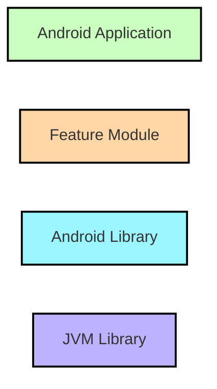
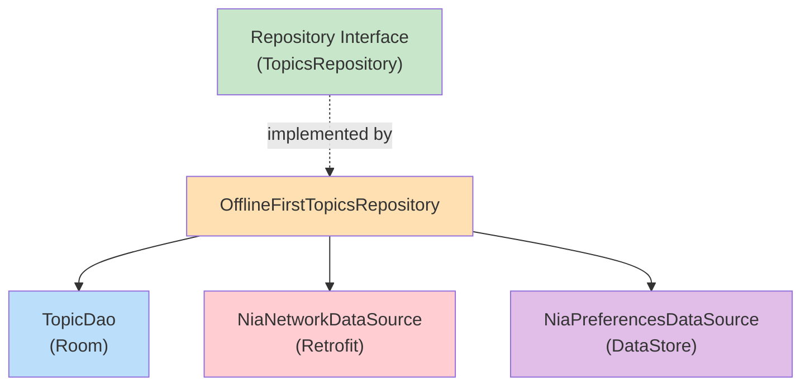
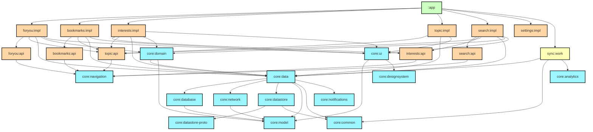

# Chapter 3 — Module Architecture

## Overview

Now in Android contains 30+ Gradle modules organized into four categories: **app**, **feature**, **core**, and **miscellaneous** (sync, benchmarks, tests). This chapter explains each module's purpose, responsibilities, allowed dependencies, and why it exists.

---

## Module Type Legend



---

## Core Modules

### `core:model`

| Aspect | Detail |
|--------|--------|
| **Type** | JVM library (no Android dependency) |
| **Purpose** | Public domain models used across all layers |
| **Contains** | `Topic`, `NewsResource`, `UserData`, `UserNewsResource`, `FollowableTopic`, `DarkThemeConfig`, `ThemeBrand`, `SearchResult` |
| **Depends on** | Nothing (leaf module) |
| **Depended on by** | Almost everything |

**Why it exists:** Models are pure Kotlin data classes. Making this a JVM library means it compiles faster and can be shared anywhere — including future KMP targets. It has zero Android framework imports.

**Key classes:**

```kotlin
data class UserData(
    val bookmarkedNewsResources: Set<String>,
    val viewedNewsResources: Set<String>,
    val followedTopics: Set<String>,
    val themeBrand: ThemeBrand,
    val darkThemeConfig: DarkThemeConfig,
    val useDynamicColor: Boolean,
    val shouldHideOnboarding: Boolean,
)
```

```kotlin
data class UserNewsResource(
    val id: String,
    val title: String,
    val content: String,
    val url: String,
    val headerImageUrl: String?,
    val publishDate: Instant,
    val type: String,
    val followableTopics: List<FollowableTopic>,
    val isSaved: Boolean,
    val hasBeenViewed: Boolean,
)
```

---

### `core:data`

| Aspect | Detail |
|--------|--------|
| **Type** | Android library |
| **Purpose** | Repository interfaces and offline-first implementations |
| **Contains** | `TopicsRepository`, `NewsRepository`, `UserDataRepository`, `SearchContentsRepository`, `RecentSearchRepository`, `OfflineFirst*` implementations, `Synchronizer`, `Syncable`, Hilt `DataModule` |
| **Depends on** | `core:model`, `core:database`, `core:network`, `core:datastore`, `core:common`, `core:notifications` |
| **Forbidden** | Feature modules, app module |

**Why it exists:** Data layer is the source of truth. Repositories abstract whether data comes from Room, DataStore, or Retrofit. Upper layers never know about DAOs or network APIs.

**Repository pattern:**



---

### `core:database`

| Aspect | Detail |
|--------|--------|
| **Type** | Android library |
| **Purpose** | Room database, DAOs, entity classes |
| **Contains** | `NiaDatabase`, `TopicDao`, `NewsResourceDao`, `RecentSearchQueryDao`, entity classes (`TopicEntity`, `NewsResourceEntity`, etc.), `PopulatedNewsResource`, model-to-entity mappers |
| **Depends on** | `core:model` |
| **Forbidden** | `core:network`, feature modules |

**Why it exists:** Isolates Room configuration and SQL queries. If the database implementation changes (for example, moving to SQLDelight), only this module is affected.

---

### `core:network`

| Aspect | Detail |
|--------|--------|
| **Type** | Android library |
| **Purpose** | Network data source, Retrofit API, network model classes |
| **Contains** | `NiaNetworkDataSource` interface, `RetrofitNiaNetwork`, network model DTOs (`NetworkNewsResource`, `NetworkTopic`, `NetworkChangeList`) |
| **Depends on** | `core:model`, `core:common` |
| **Forbidden** | `core:database`, feature modules |

**Why it exists:** Network concerns (serialization format, endpoints, HTTP client) are isolated. Swapping Retrofit for Ktor would only affect this module.

---

### `core:datastore`

| Aspect | Detail |
|--------|--------|
| **Type** | Android library |
| **Purpose** | Proto DataStore for user preferences |
| **Contains** | `NiaPreferencesDataSource`, `ChangeListVersions`, `UserPreferencesSerializer` |
| **Depends on** | `core:model`, `core:datastore-proto`, `core:common` |

**Why it exists:** User preferences (followed topics, theme, onboarding state) are persisted using Proto DataStore, which provides type-safe access via generated protobuf classes.

---

### `core:datastore-proto`

| Aspect | Detail |
|--------|--------|
| **Type** | JVM library |
| **Purpose** | `.proto` file definitions for DataStore |
| **Contains** | `user_preferences.proto` |

**Why it exists:** Proto file compilation is isolated so changes to the schema don't trigger recompilation of the entire data layer.

---

### `core:domain`

| Aspect | Detail |
|--------|--------|
| **Type** | Android library |
| **Purpose** | Use cases that combine and transform data from repositories |
| **Contains** | `GetFollowableTopicsUseCase`, `GetSearchContentsUseCase`, `GetRecentSearchQueriesUseCase` |
| **Depends on** | `core:data`, `core:model` |
| **Forbidden** | UI, ViewModel, Android framework imports |

**Why it exists:** Use cases prevent duplicate logic across ViewModels. When multiple screens need the same data transformation, a use case provides it once.

```kotlin
class GetFollowableTopicsUseCase @Inject constructor(
    private val topicsRepository: TopicsRepository,
    private val userDataRepository: UserDataRepository,
) {
    operator fun invoke(sortBy: TopicSortField = NONE): Flow<List<FollowableTopic>> =
        combine(
            userDataRepository.userData,
            topicsRepository.getTopics(),
        ) { userData, topics ->
            topics.map { topic ->
                FollowableTopic(
                    topic = topic,
                    isFollowed = topic.id in userData.followedTopics,
                )
            }
        }
}
```

---

### `core:navigation`

| Aspect | Detail |
|--------|--------|
| **Type** | Android library |
| **Purpose** | Core navigation primitives: `Navigator`, `NavigationState` |
| **Contains** | `Navigator` class, `NavigationState` class, `rememberNavigationState()`, `toEntries()` |
| **Depends on** | Navigation 3 runtime |

**Why it exists:** Navigation logic (managing back stacks, top-level vs sub-stacks) is shared infrastructure. Feature modules receive a `Navigator` instance; they don't manage back stacks directly.

---

### `core:designsystem`

| Aspect | Detail |
|--------|--------|
| **Type** | Android library |
| **Purpose** | Design system: theme, typography, colors, icons, reusable Material 3 components |
| **Contains** | `NiaTheme`, `NiaIcons`, `NiaButton`, `NiaTopAppBar`, `NiaNavigationSuiteScaffold`, `NiaBackground`, `NiaGradientBackground` |
| **Depends on** | Nothing project-specific |

**Why it exists:** A centralized design system ensures visual consistency. All features import components from here rather than creating custom ones.

---

### `core:ui`

| Aspect | Detail |
|--------|--------|
| **Type** | Android library |
| **Purpose** | Composite UI components that depend on domain models |
| **Contains** | `NewsFeed`, `NewsResourceCardExpanded`, `NewsFeedUiState`, `LocalTimeZone`, `TrackDisposableJank` |
| **Depends on** | `core:model`, `core:designsystem` |

**Why it exists:** Unlike `designsystem` (which is model-agnostic), `ui` contains components that render domain models like `UserNewsResource`. Multiple features reuse these components.

---

### `core:common`

| Aspect | Detail |
|--------|--------|
| **Type** | Android library |
| **Purpose** | Shared utilities |
| **Contains** | `NiaDispatchers`, `Dispatcher` qualifier annotation, `Result` wrapper, extension functions |
| **Depends on** | Nothing |

---

### `core:analytics`

| Aspect | Detail |
|--------|--------|
| **Type** | Android library |
| **Purpose** | Analytics abstraction |
| **Contains** | `AnalyticsHelper` interface, `AnalyticsEvent`, `LocalAnalyticsHelper` CompositionLocal, Firebase or no-op implementations |
| **Depends on** | Nothing project-specific |

**Why it exists:** Analytics is a cross-cutting concern. Using an interface allows swapping Firebase for a no-op implementation in tests or builds without Firebase.

---

### `core:notifications`

| Aspect | Detail |
|--------|--------|
| **Type** | Android library |
| **Purpose** | Notification posting, deep link constants |
| **Contains** | `Notifier` interface, notification channel setup, `DEEP_LINK_NEWS_RESOURCE_ID_KEY` |
| **Depends on** | `core:model` |

---

### `core:testing`

| Aspect | Detail |
|--------|--------|
| **Type** | Android library |
| **Purpose** | Shared test infrastructure |
| **Contains** | `NiaTestRunner`, `TestDispatcherRule`, test utilities |
| **Depends on** | `core:common`, `core:data`, `core:model`, test libraries |

---

### `core:data-test`

| Aspect | Detail |
|--------|--------|
| **Purpose** | Fake repository implementations for tests |
| **Contains** | `TestTopicsRepository`, `TestNewsRepository`, `TestUserDataRepository` |
| **Used by** | Feature module tests |

---

## Feature Modules

Each feature follows identical structure:

```
feature/
  <name>/
    api/
      build.gradle.kts        # Uses nowinandroid.android.feature.api plugin
      src/main/kotlin/.../
        navigation/
          <Name>NavKey.kt      # @Serializable NavKey
    impl/
      build.gradle.kts        # Uses nowinandroid.android.feature.impl plugin
      src/main/kotlin/.../
        <Name>Screen.kt       # @Composable screen
        <Name>ViewModel.kt    # @HiltViewModel
        navigation/
          <Name>EntryProvider.kt  # EntryProviderScope extension
```

| Feature | NavKey | Arguments | Description |
|---------|--------|-----------|-------------|
| `foryou` | `ForYouNavKey` (object) | None | Main feed, onboarding |
| `bookmarks` | `BookmarksNavKey` (object) | None | Saved articles |
| `interests` | `InterestsNavKey` (data class) | `initialTopicId: String?` | Topic browser, list-detail |
| `topic` | `TopicNavKey` (data class) | `id: String` | Topic detail |
| `search` | `SearchNavKey` (object) | None | Full-text search |
| `settings` | N/A | N/A | Dialog, no navigation key |

---

## Module Dependency Graph



---

## Summary

NiA uses granular modules to enforce separation of concerns. Core modules provide shared infrastructure, feature modules own screen-level logic, and the app module wires everything together.

## Key Takeaways

- `core:model` is a pure Kotlin (JVM) leaf module — maximum reusability
- `core:data` contains repository interfaces and offline-first implementations
- Feature `api` modules expose only navigation keys — minimal surface area
- Feature `impl` modules contain the screen, ViewModel, and entry provider
- Convention plugins standardize how every module is configured

## Best Practices

- Keep `core:model` free of Android framework dependencies
- When shared code is used by 2+ features, put it in a core module
- Use `@Binds` in Hilt modules to bind interfaces to implementations (see `DataModule`)
- Keep feature `api` modules extremely lightweight — only `NavKey` + navigation extensions

## Common Mistakes

- **Adding UI code to `core:data`** — Data layer has no UI awareness
- **Importing `core:database` from a feature** — Features go through `core:data` repositories
- **Creating circular dependencies between core modules** — Graph must be a DAG
- **Putting business logic in `core:ui`** — That module is for composite UI components only
