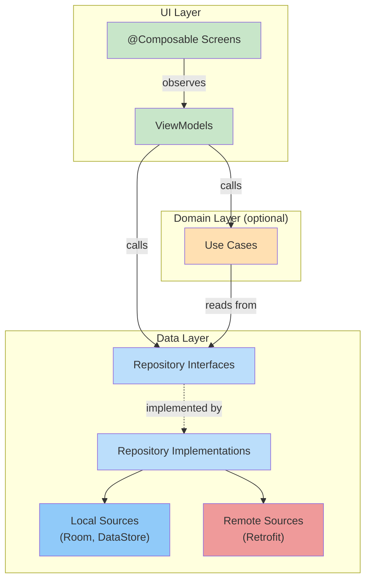
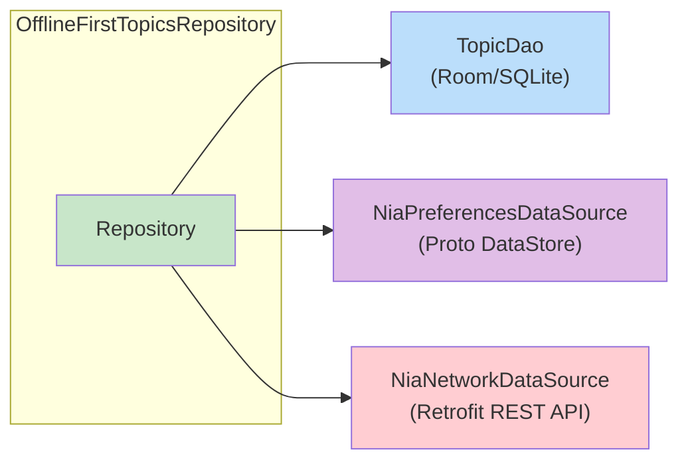
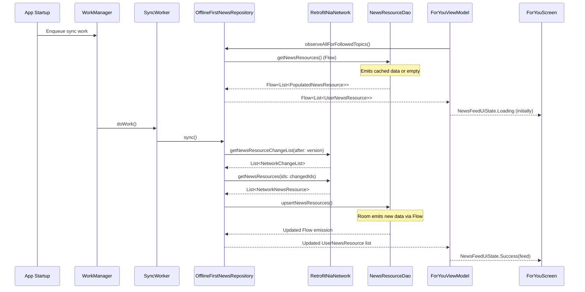
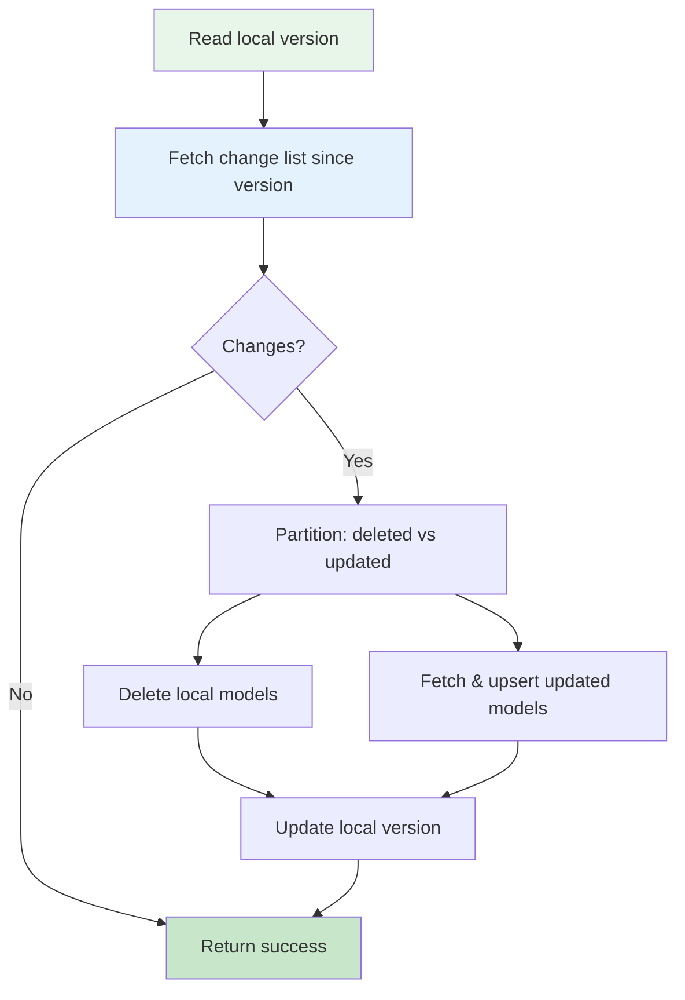

# Chapter 4 — Clean Architecture & Data Flow

## Architecture vs "Clean Architecture"

> **Important:** The official Android architecture used in NiA is **not** "Clean Architecture" as defined by Robert C. Martin. While both share the concept of layer separation, the Android guidance uses different terminology, different dependency rules, and does not mandate use cases for every interaction.

| Concept | Clean Architecture (Uncle Bob) | Android Architecture (NiA) |
|---------|------|------|
| Layers | Entities, Use Cases, Interface Adapters, Frameworks | Data, Domain (optional), UI |
| Mandatory Use Cases | Yes | No — only when they reduce duplication |
| Repository Location | Interface Adapters layer | Data layer (implementation and interface) |
| Entity Definition | Business objects with methods | Simple data classes in `core:model` |
| Dependency Rule | Inward only | Lower layers don't know about upper layers |

---

## The Three Layers



---

## Data Layer Deep Dive

### Repository Pattern

Repositories are the **single public API** of the data layer. Upper layers interact with `TopicsRepository`, `NewsRepository`, `UserDataRepository` — never with DAOs or network APIs directly.

**Interface (in `core:data`):**

```kotlin
interface NewsRepository : Syncable {
    fun getNewsResources(
        query: NewsResourceQuery = NewsResourceQuery(
            filterTopicIds = null,
            filterNewsIds = null,
        ),
    ): Flow<List<NewsResource>>
}
```

**Implementation (in `core:data`, marked `internal`):**

```kotlin
internal class OfflineFirstNewsRepository @Inject constructor(
    private val niaPreferencesDataSource: NiaPreferencesDataSource,
    private val newsResourceDao: NewsResourceDao,
    private val topicDao: TopicDao,
    private val network: NiaNetworkDataSource,
    private val notifier: Notifier,
) : NewsRepository {

    override fun getNewsResources(query: NewsResourceQuery): Flow<List<NewsResource>> =
        newsResourceDao.getNewsResources(/* ... */)
            .map { it.map(PopulatedNewsResource::asExternalModel) }
}
```

**Key design decision:** The implementation is `internal`. Only the interface is exposed to upper layers via Hilt binding:

```kotlin
@Module
@InstallIn(SingletonComponent::class)
abstract class DataModule {
    @Binds
    internal abstract fun bindsNewsResourceRepository(
        newsRepository: OfflineFirstNewsRepository,
    ): NewsRepository
}
```

### Data Sources

Each repository may depend on multiple data sources:



| Data Source | Backed By | Purpose |
|---|---|---|
| `TopicDao` | Room/SQLite | Persistent relational topic data |
| `NiaPreferencesDataSource` | Proto DataStore | User preferences (followed topics, theme) |
| `NiaNetworkDataSource` | Retrofit | Remote API for topics and news |

### Reading Data

Data is **always** exposed as `Flow` streams, never as one-shot snapshots:

```kotlin
// ✅ Correct — reactive stream
fun getTopics(): Flow<List<Topic>>

// ❌ Wrong — snapshot that could be stale
suspend fun getTopics(): List<Topic>
```

**Why:** A snapshot (`getModel()`) has no guarantee of freshness. A `Flow` automatically delivers updates when data changes.

### Writing Data

Writing is done via `suspend` functions. The caller controls the coroutine scope:

```kotlin
interface UserDataRepository {
    suspend fun setTopicIdFollowed(followedTopicId: String, followed: Boolean)
    suspend fun setNewsResourceBookmarked(newsResourceId: String, bookmarked: Boolean)
}
```

### Data Mapping

The project maintains separate model types at each boundary:

```mermaid
graph LR
    NET_MODEL["NetworkNewsResource<br/>(network DTO)"]
    ENTITY["NewsResourceEntity<br/>(Room entity)"]
    POPULATED["PopulatedNewsResource<br/>(Room relation)"]
    MODEL["NewsResource<br/>(public model)"]
    USER_MODEL["UserNewsResource<br/>(enriched with user data)"]

    NET_MODEL -->|asEntity()| ENTITY
    ENTITY -->|Room query| POPULATED
    POPULATED -->|asExternalModel()| MODEL
    MODEL -->|+ UserData| USER_MODEL

    style NET_MODEL fill:#FFCDD2
    style ENTITY fill:#BBDEFB
    style POPULATED fill:#BBDEFB
    style MODEL fill:#C8E6C9
    style USER_MODEL fill:#FFF9C4
```

**Why separate models:**
- **Network DTOs** match API schema (may change with backend)
- **Room entities** match database schema (has relations, foreign keys)
- **Public models** match what the domain/UI needs (stable contract)
- No layer leaks its internal representation to another

---

## Domain Layer

The domain layer contains use cases — classes with a single `operator fun invoke` that combine data from multiple repositories.

**When to use a use case:** When the same data transformation is needed by 2+ ViewModels.

```kotlin
class GetFollowableTopicsUseCase @Inject constructor(
    private val topicsRepository: TopicsRepository,
    private val userDataRepository: UserDataRepository,
) {
    operator fun invoke(sortBy: TopicSortField = NONE): Flow<List<FollowableTopic>> =
        combine(
            userDataRepository.userData,
            topicsRepository.getTopics(),
        ) { userData, topics ->
            topics.map { topic ->
                FollowableTopic(
                    topic = topic,
                    isFollowed = topic.id in userData.followedTopics,
                )
            }
        }
}
```

**Note:** NiA does **not** use use cases for write operations (events). ViewModels call repository `suspend` functions directly.

---

## UI Layer

ViewModels receive `Flow` streams from use cases/repositories and transform them into `StateFlow` of UI state:

```kotlin
@HiltViewModel
class ForYouViewModel @Inject constructor(
    userNewsResourceRepository: UserNewsResourceRepository,
    getFollowableTopics: GetFollowableTopicsUseCase,
    // ...
) : ViewModel() {

    val feedState: StateFlow<NewsFeedUiState> =
        userNewsResourceRepository.observeAllForFollowedTopics()
            .map(NewsFeedUiState::Success)
            .stateIn(
                scope = viewModelScope,
                started = SharingStarted.WhileSubscribed(5_000),
                initialValue = NewsFeedUiState.Loading,
            )
}
```

---

## Complete Data Flow: Displaying News on For You



**Step-by-step:**

| Step | What Happens | Code Reference |
|------|-------------|----------------|
| 1 | WorkManager enqueues sync job on app startup | `Sync.initialize` |
| 2 | `ForYouViewModel` subscribes to user news resources | `ForYouViewModel.feedState` |
| 3 | Repository reads from Room (source of truth) | `OfflineFirstNewsRepository.getNewsResources` |
| 4 | Room emits cached data (or empty if first launch) | `NewsResourceDao.getNewsResources` |
| 5 | UI shows `Loading` state | `NewsFeedUiState.Loading` |
| 6 | SyncWorker calls repository `syncWith` | `SyncWorker.doWork` |
| 7 | Repository fetches change list from network | `network.getNewsResourceChangeList` |
| 8 | Repository fetches changed resources by ID | `network.getNewsResources(ids)` |
| 9 | Repository upserts into Room | `newsResourceDao.upsertNewsResources` |
| 10 | Room Flow automatically re-emits | Automatic Room invalidation |
| 11 | Repository maps entity to public model | `PopulatedNewsResource::asExternalModel` |
| 12 | ViewModel receives updated list, emits `Success` | `NewsFeedUiState.Success` |

---

## Synchronization Strategy

NiA uses a **change-list-based** sync strategy inspired by version control:

```kotlin
suspend fun Synchronizer.changeListSync(
    versionReader: (ChangeListVersions) -> Int,
    changeListFetcher: suspend (Int) -> List<NetworkChangeList>,
    versionUpdater: ChangeListVersions.(Int) -> ChangeListVersions,
    modelDeleter: suspend (List<String>) -> Unit,
    modelUpdater: suspend (List<String>) -> Unit,
)
```



**Like git:**
1. Read local HEAD (version number)
2. Fetch changes since HEAD (`git fetch`)
3. Apply deletes and updates (`git pull`)
4. Update local HEAD

---

## Summary

NiA implements a pragmatic architecture: repositories own data, use cases combine it, ViewModels transform it into UI state. The data always flows as reactive streams from local storage upward.

## Key Takeaways

- Repository implementations are `internal` — only interfaces are public
- All reads are `Flow` streams; all writes are `suspend` functions
- Each boundary has its own model type (DTO, Entity, Model)
- Sync uses a change-list strategy similar to version control
- Use cases are optional — only used when they reduce duplication

## Best Practices

- Never expose Room entities outside `core:data`
- Use `stateIn(SharingStarted.WhileSubscribed(5_000))` to share state efficiently
- Keep sync logic in repositories, orchestrate in `SyncWorker`
- Map between model types at each boundary — never leak internal representations

## Common Mistakes

- **Calling network directly from ViewModel** — Always go through a repository
- **Exposing `PopulatedNewsResource` (entity) to UI** — Map to `NewsResource` first
- **Using `SharingStarted.Eagerly`** — Wastes resources when no collector is active
- **Skipping the change-list pattern** — Fetching all data on every sync is expensive
