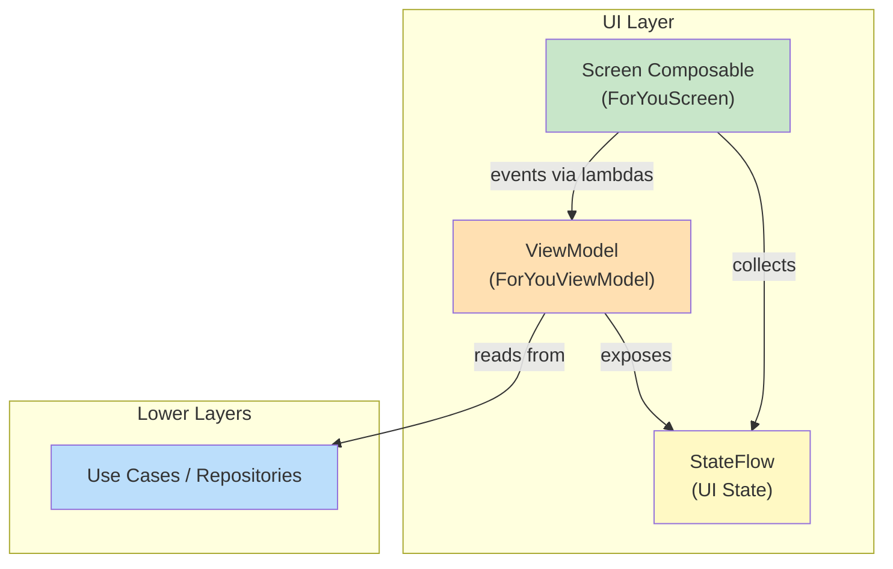

# Chapter 5 — UI Layer

## Overview

NiA's UI layer is built entirely with **Jetpack Compose** and **Material 3**. There are no XML layouts, no Fragments, no View system components. The layer follows **Unidirectional Data Flow (UDF)**: ViewModels produce state, Composables consume it, and user actions flow back as events.

---

## Compose Architecture



---

## Composable Hierarchy

Each feature follows a consistent composable hierarchy:

```
Feature Entry Provider (navigation)
  └── Screen Composable (stateful — connected to ViewModel)
       └── Screen Content (stateless — receives data as parameters)
            └── Design System Components (NiaButton, NiaTopAppBar, etc.)
```

**Stateful vs Stateless pattern:**

```kotlin
// STATEFUL — connected to ViewModel (in feature entry provider)
@Composable
fun ForYouScreen(
    onTopicClick: (String) -> Unit,
    viewModel: ForYouViewModel = hiltViewModel(),
) {
    val feedState by viewModel.feedState.collectAsStateWithLifecycle()
    val onboardingState by viewModel.onboardingUiState.collectAsStateWithLifecycle()

    ForYouScreen(
        feedState = feedState,
        onboardingUiState = onboardingState,
        onTopicClick = onTopicClick,
        onTopicCheckedChanged = viewModel::updateTopicSelection,
        saveFollowedTopics = viewModel::dismissOnboarding,
        // ...
    )
}

// STATELESS — pure function of its parameters
@Composable
internal fun ForYouScreen(
    feedState: NewsFeedUiState,
    onboardingUiState: OnboardingUiState,
    onTopicClick: (String) -> Unit,
    // ...
) {
    // Pure rendering based on state
}
```

**Why this split:**
- Stateless composable is testable in isolation with `ComposeTestRule`
- ViewModel connection is handled at the navigation layer
- Previews can use the stateless variant with fake data

---

## ViewModel Responsibilities

ViewModels in NiA have exactly three jobs:

1. **Transform data streams into UI state** — Combine `Flow`s from repositories/use cases into `StateFlow<UiState>`
2. **Handle user events** — Receive user actions as method calls, delegate to repositories
3. **Scope coroutines** — Use `viewModelScope` for write operations

**What ViewModels do NOT do:**
- No direct Android framework calls (no `Context`, no `Resources`)
- No navigation logic (navigation is handled by `Navigator` in the entry provider)
- No UI rendering decisions

### Example: TopicViewModel

```kotlin
@HiltViewModel(assistedFactory = TopicViewModel.Factory::class)
class TopicViewModel @AssistedInject constructor(
    private val userDataRepository: UserDataRepository,
    topicsRepository: TopicsRepository,
    userNewsResourceRepository: UserNewsResourceRepository,
    @Assisted val topicId: String,
) : ViewModel() {

    val topicUiState: StateFlow<TopicUiState> = topicUiState(
        topicId, userDataRepository, topicsRepository,
    ).stateIn(
        scope = viewModelScope,
        started = SharingStarted.WhileSubscribed(5_000),
        initialValue = TopicUiState.Loading,
    )

    val newsUiState: StateFlow<NewsUiState> = newsUiState(
        topicId, userDataRepository, userNewsResourceRepository,
    ).stateIn(
        scope = viewModelScope,
        started = SharingStarted.WhileSubscribed(5_000),
        initialValue = NewsUiState.Loading,
    )

    fun followTopicToggle(followed: Boolean) {
        viewModelScope.launch {
            userDataRepository.setTopicIdFollowed(topicId, followed)
        }
    }

    fun bookmarkNews(newsResourceId: String, bookmarked: Boolean) {
        viewModelScope.launch {
            userDataRepository.setNewsResourceBookmarked(newsResourceId, bookmarked)
        }
    }
}
```

**Key patterns:**
- `SharingStarted.WhileSubscribed(5_000)` — Keeps the upstream active for 5 seconds after last collector disappears (handles config changes)
- `@AssistedInject` + `@Assisted` — For ViewModels that need runtime arguments (like `topicId`)
- Events are plain method calls — no `Channel`, no `SharedFlow` for events

---

## UI State Modeling

UI state is modeled as **sealed hierarchies using interfaces and immutable data classes**:

```kotlin
sealed interface TopicUiState {
    data class Success(val followableTopic: FollowableTopic) : TopicUiState
    data object Error : TopicUiState
    data object Loading : TopicUiState
}

sealed interface NewsUiState {
    data class Success(val news: List<UserNewsResource>) : NewsUiState
    data object Error : NewsUiState
    data object Loading : NewsUiState
}
```

**Why sealed hierarchies:**
- Compiler enforces exhaustive `when` handling — no forgotten states
- Each state carries exactly the data it needs — `Loading` has no data, `Success` has the payload
- `data object` for stateless variants — equality, hashCode, toString for free

### The UDF Cycle

```mermaid
graph LR
    USER["User Action<br/>(tap bookmark)"] --> VM["ViewModel<br/>bookmarkNews()"]
    VM --> REPO["Repository<br/>setNewsResourceBookmarked()"]
    REPO --> DS["DataStore writes"]
    DS --> FLOW["Flow emits updated UserData"]
    FLOW --> VM2["ViewModel receives<br/>new state"]
    VM2 --> UI["Composable re-renders<br/>with updated bookmark"]

    style USER fill:#FFCDD2
    style VM fill:#FFE0B2
    style REPO fill:#BBDEFB
    style DS fill:#E1BEE7
    style FLOW fill:#C8E6C9
    style VM2 fill:#FFE0B2
    style UI fill:#C8E6C9
```



The user taps bookmark. The ViewModel calls the repository. The repository writes to DataStore. DataStore emits a new `UserData`. The repository's `Flow` re-emits. The ViewModel's `StateFlow` updates. The Composable re-renders with the new bookmark state.

**No manual state updates needed.** The reactive chain handles everything.

---

## Collecting State in Compose

NiA uses `collectAsStateWithLifecycle()` from `androidx.lifecycle:lifecycle-runtime-compose`:

```kotlin
val feedState by viewModel.feedState.collectAsStateWithLifecycle()
```

**Why not `collectAsState()`?**
- `collectAsStateWithLifecycle()` stops collecting when the lifecycle is below `STARTED`
- Prevents wasted work when the app is in the background
- Automatically resumes when the app returns to foreground

---

## Immutable State

All UI state classes are immutable (`data class` or `data object`). State is never mutated in place — a new instance is always emitted.

**Benefits:**
- Compose can skip recomposition when state hasn't changed (structural equality)
- Thread-safe — no concurrent modification issues
- Predictable — each emission is a complete snapshot

---

## Events: User Interactions

User actions are passed from Composables to ViewModels as **lambda expressions**:

```kotlin
// In the entry provider:
ForYouScreen(
    onTopicClick = navigator::navigateToTopic,
    // ...
)

// In the screen composable:
@Composable
fun ForYouScreen(
    onTopicClick: (String) -> Unit,
    // ...
)
```

**No event objects, no sealed event classes, no SharedFlow for events.** Just function calls. NiA deliberately chose simplicity here.

---

## Summary

NiA's UI layer separates state production (ViewModel) from state consumption (Compose). ViewModels transform `Flow` streams into `StateFlow` of sealed UI state. Composables observe state with lifecycle awareness and send events back as lambda calls.

## Key Takeaways

- Stateful composables connect to ViewModels; stateless composables receive data as parameters
- UI state uses sealed interfaces with `Loading`, `Error`, `Success` variants
- `collectAsStateWithLifecycle()` is preferred over `collectAsState()`
- Events are simple lambda function calls — no event bus or `SharedFlow`
- `SharingStarted.WhileSubscribed(5_000)` handles configuration changes gracefully

## Best Practices

- Split every screen into stateful wrapper + stateless content composable
- Use `data object` for states without data (`Loading`, `Error`)
- Keep ViewModels free of Compose imports — they produce `StateFlow`, nothing else
- Pass navigation actions as lambdas from the entry provider, not from ViewModel

## Common Mistakes

- **Putting navigation logic in ViewModel** — Navigation is handled at the entry provider level
- **Using `MutableState` in ViewModel** — Use `StateFlow` for state production
- **Mutating state in place** — Always emit new immutable instances
- **Using `collectAsState()` without lifecycle awareness** — Wastes resources in background
