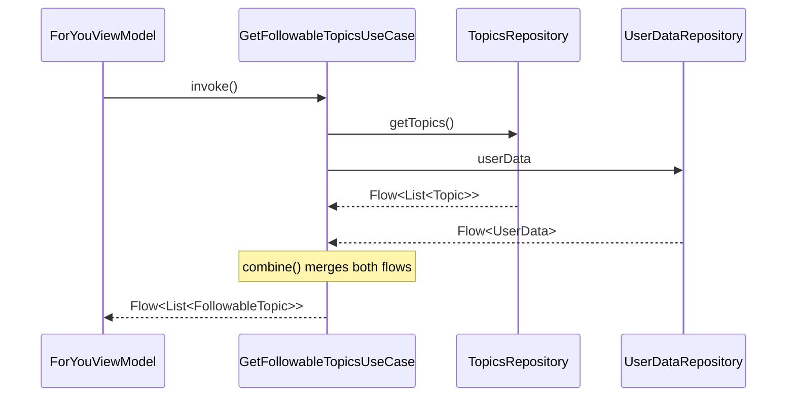

# Chapter 6 — Domain Layer

## Overview

The domain layer in NiA is **optional and lightweight**. It contains use cases — classes that combine and transform data from multiple repositories. Not every data access goes through a use case; ViewModels often call repositories directly for simple operations.

---

## When to Use a Use Case

| Scenario | Use Case? | Why |
|----------|-----------|-----|
| Two ViewModels need the same combined data | **Yes** | Eliminates duplication |
| Single ViewModel, single repository call | **No** | ViewModel calls repository directly |
| Complex business rule (e.g., sorting, filtering, combining) | **Yes** | Keeps ViewModel thin |
| Simple write operation (bookmark, follow) | **No** | ViewModel calls `suspend` function directly |

---

## Use Case Convention

Every use case in NiA follows the same pattern:

1. **Single class** with `@Inject constructor`
2. **Single `operator fun invoke`** method
3. **Returns `Flow`** (never a one-shot value)
4. **Combines data** from 2+ repositories

```kotlin
class GetFollowableTopicsUseCase @Inject constructor(
    private val topicsRepository: TopicsRepository,
    private val userDataRepository: UserDataRepository,
) {
    operator fun invoke(sortBy: TopicSortField = NONE): Flow<List<FollowableTopic>> =
        combine(
            userDataRepository.userData,
            topicsRepository.getTopics(),
        ) { userData, topics ->
            topics.map { topic ->
                FollowableTopic(
                    topic = topic,
                    isFollowed = topic.id in userData.followedTopics,
                )
            }.let { followedTopics ->
                when (sortBy) {
                    NAME -> followedTopics.sortedBy { it.topic.name }
                    else -> followedTopics
                }
            }
        }
}
```

**Usage in ViewModel:**

```kotlin
// Use case as constructor parameter
class ForYouViewModel @Inject constructor(
    getFollowableTopics: GetFollowableTopicsUseCase,
) : ViewModel() {

    val onboardingUiState = combine(
        shouldShowOnboarding,
        getFollowableTopics(), // operator invoke — called like a function
    ) { show, topics -> /* ... */ }
}
```

---

## Use Cases in the Project

| Use Case | Combines | Used By |
|----------|----------|---------|
| `GetFollowableTopicsUseCase` | `TopicsRepository` + `UserDataRepository` | `ForYouViewModel`, `InterestsViewModel` |
| `GetSearchContentsUseCase` | `SearchContentsRepository` + `UserDataRepository` | `SearchViewModel` |
| `GetRecentSearchQueriesUseCase` | `RecentSearchRepository` | `SearchViewModel` |

---

## Data Flow Through Domain



---

## Threading

Use cases in NiA **do not switch dispatchers**. They operate on whatever dispatcher the caller uses. Room and DataStore already handle dispatcher switching internally:

- Room `Flow` queries emit on the query executor thread
- DataStore reads emit on the DataStore coroutine context
- `combine()` inherits the caller's context

**No `withContext(Dispatchers.IO)` inside use cases.** The repositories handle this.

---

## Error Handling

NiA uses a `Result` wrapper (in `core:common`) to handle errors at the Flow level:

```kotlin
sealed interface Result<out T> {
    data class Success<T>(val data: T) : Result<T>
    data class Error(val exception: Throwable) : Result<Nothing>
    data object Loading : Result<Nothing>
}

fun <T> Flow<T>.asResult(): Flow<Result<T>> = map<T, Result<T>> { Result.Success(it) }
    .onStart { emit(Result.Loading) }
    .catch { emit(Result.Error(it)) }
```

**Usage in ViewModel:**

```kotlin
private fun topicUiState(/* ... */): Flow<TopicUiState> {
    return combine(followedTopicIds, topicStream, ::Pair)
        .asResult()
        .map { result ->
            when (result) {
                is Result.Success -> TopicUiState.Success(/* ... */)
                is Result.Loading -> TopicUiState.Loading
                is Result.Error -> TopicUiState.Error
            }
        }
}
```

The `.asResult()` extension converts any `Flow<T>` into a `Flow<Result<T>>` that emits `Loading` on start, `Success` on each value, and `Error` on exception.

---

## Testing Use Cases

Use cases are tested with fake repositories:

```kotlin
class GetFollowableTopicsUseCaseTest {
    private val topicsRepository = TestTopicsRepository()
    private val userDataRepository = TestUserDataRepository()

    val useCase = GetFollowableTopicsUseCase(
        topicsRepository = topicsRepository,
        userDataRepository = userDataRepository,
    )

    @Test
    fun whenTopicsAndUserDataAvailable_returnsFollowableTopics() = runTest {
        // Setup fake data
        topicsRepository.sendTopics(sampleTopics)
        userDataRepository.setFollowedTopicIds(setOf("1"))

        // Collect and assert
        useCase().test {
            val result = awaitItem()
            assertEquals(true, result.first().isFollowed)
        }
    }
}
```

**Key:** No mocks needed. Fake repositories from `core:data-test` provide controllable data streams.

---

## Summary

NiA's domain layer is pragmatic — it exists only when it reduces duplication. Use cases combine `Flow` streams from repositories, return `Flow` results, and contain no Android framework logic.

## Key Takeaways

- Use cases are **optional** — only create them when 2+ ViewModels share logic
- Convention: one class, one `operator fun invoke`, returns `Flow`
- No dispatcher switching — repositories handle threading
- Error handling uses `asResult()` extension on `Flow`

## Best Practices

- Name use cases as actions: `GetFollowableTopicsUseCase`, not `TopicsUseCase`
- Keep use cases stateless — inject repositories, no mutable fields
- Test with fake repositories, not mocks
- Don't create use cases for simple pass-through operations

## Common Mistakes

- **Creating a use case for every repository call** — Only when it adds value
- **Putting write operations in use cases** — NiA calls repositories directly for writes
- **Adding Android imports to use cases** — Domain layer should be Android-free
- **Switching dispatchers in use cases** — Let repositories handle this
