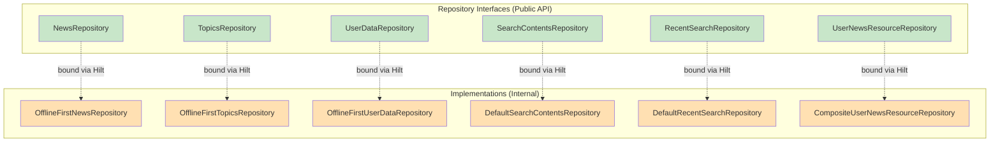
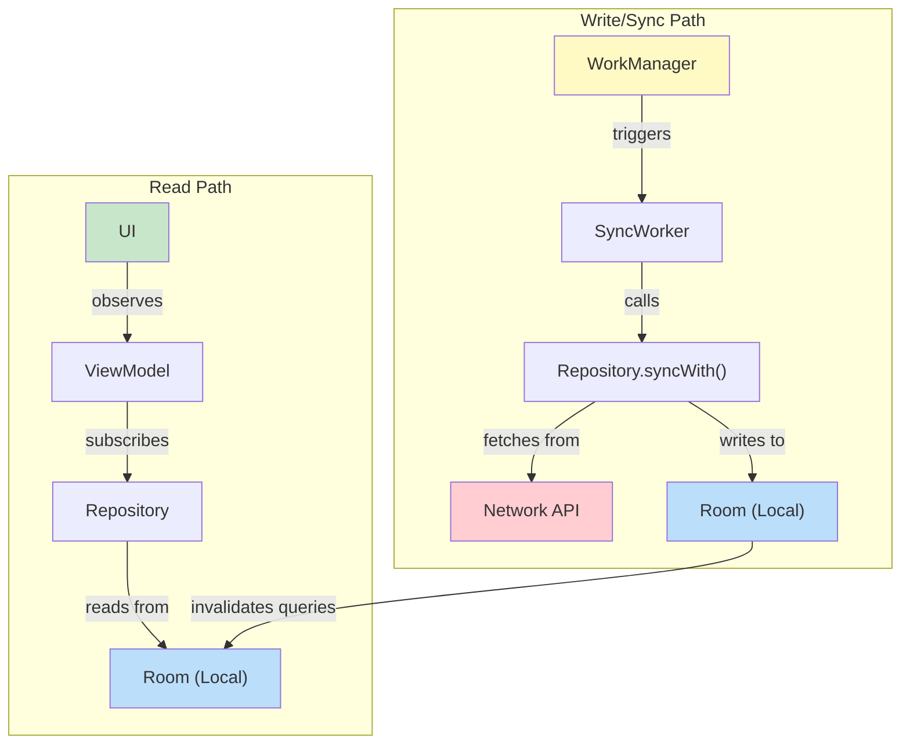
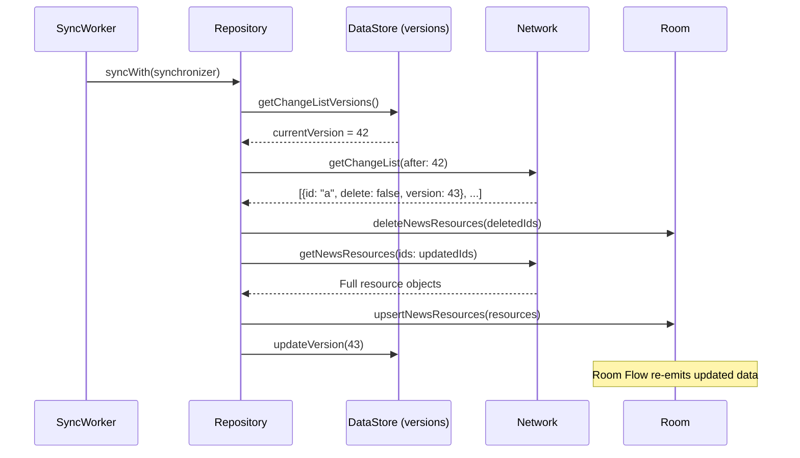

# Chapter 7 — Data Layer

## Overview

The data layer is the **source of truth** for all app data. It implements an **offline-first** strategy: local storage (Room + DataStore) is always the primary read source, while the network serves as a sync mechanism.

---

## Repository Architecture



### Hilt Binding

All repository bindings live in `DataModule`:

```kotlin
@Module
@InstallIn(SingletonComponent::class)
abstract class DataModule {
    @Binds
    internal abstract fun bindsTopicRepository(
        topicsRepository: OfflineFirstTopicsRepository,
    ): TopicsRepository

    @Binds
    internal abstract fun bindsNewsResourceRepository(
        newsRepository: OfflineFirstNewsRepository,
    ): NewsRepository

    @Binds
    internal abstract fun bindsUserDataRepository(
        userDataRepository: OfflineFirstUserDataRepository,
    ): UserDataRepository
    // ...
}
```

---

## Local Data Sources

### Room Database

The `core:database` module contains:

| Component | Purpose |
|-----------|---------|
| `NiaDatabase` | Room database class |
| `TopicDao` | CRUD for topics |
| `NewsResourceDao` | CRUD for news resources |
| `RecentSearchQueryDao` | CRUD for recent searches |
| `TopicEntity` | Room entity for topics |
| `NewsResourceEntity` | Room entity for news |
| `NewsResourceTopicCrossRef` | Many-to-many junction table |
| `PopulatedNewsResource` | Room `@Relation` combining news + topics |

**Room provides reactive reads via Flow:**

```kotlin
@Query("SELECT * FROM topics")
fun getTopics(): Flow<List<TopicEntity>>
```

When data changes in the database, Room automatically re-emits the query result. This is the mechanism that makes the entire reactive chain work.

### Proto DataStore

The `core:datastore` module stores user preferences using Protocol Buffers:

| Data | Storage |
|------|---------|
| Followed topics | Proto DataStore |
| Bookmarked news | Proto DataStore |
| Viewed news | Proto DataStore |
| Theme preference | Proto DataStore |
| Onboarding completion | Proto DataStore |
| Change list versions | Proto DataStore |

---

## Remote Data Source

The `core:network` module provides:

```kotlin
interface NiaNetworkDataSource {
    suspend fun getTopics(ids: List<String>? = null): List<NetworkTopic>
    suspend fun getNewsResources(ids: List<String>? = null): List<NetworkNewsResource>
    suspend fun getTopicChangeList(after: Int? = null): List<NetworkChangeList>
    suspend fun getNewsResourceChangeList(after: Int? = null): List<NetworkChangeList>
}
```

Two implementations exist:
- `RetrofitNiaNetwork` — Production implementation using Retrofit
- `DemoNiaNetworkDataSource` — Demo flavor reading from local JSON assets

---

## Offline-First Strategy



**Read and write paths are completely separate:**
- **Reads** always go to Room (fast, always available, works offline)
- **Writes** from network go to Room, which then triggers Flow re-emission
- UI never waits for network — it shows cached data immediately

---

## Synchronization Strategy

### The Synchronizer / Syncable Pattern

```kotlin
interface Synchronizer {
    suspend fun getChangeListVersions(): ChangeListVersions
    suspend fun updateChangeListVersions(update: ChangeListVersions.() -> ChangeListVersions)
    suspend fun Syncable.sync() = this@sync.syncWith(this@Synchronizer)
}

interface Syncable {
    suspend fun syncWith(synchronizer: Synchronizer): Boolean
}
```

- `Synchronizer` — Manages version tracking (implemented by `SyncWorker`)
- `Syncable` — Any repository that can sync (implemented by `NewsRepository`, `TopicsRepository`)

### Change List Sync Algorithm

```kotlin
suspend fun Synchronizer.changeListSync(
    versionReader: (ChangeListVersions) -> Int,
    changeListFetcher: suspend (Int) -> List<NetworkChangeList>,
    versionUpdater: ChangeListVersions.(Int) -> ChangeListVersions,
    modelDeleter: suspend (List<String>) -> Unit,
    modelUpdater: suspend (List<String>) -> Unit,
)
```



**Error handling:** If sync fails, WorkManager retries with exponential backoff. The `suspendRunCatching` utility catches exceptions while respecting structured concurrency (never catches `CancellationException`).

### SyncWorker

```kotlin
@HiltWorker
internal class SyncWorker @AssistedInject constructor(
    // ...
    private val topicRepository: TopicsRepository,
    private val newsRepository: NewsRepository,
    private val searchContentsRepository: SearchContentsRepository,
) : CoroutineWorker(appContext, workerParams), Synchronizer {

    override suspend fun doWork(): Result = withContext(ioDispatcher) {
        val syncedSuccessfully = awaitAll(
            async { topicRepository.sync() },
            async { newsRepository.sync() },
        ).all { it }

        if (syncedSuccessfully) {
            searchContentsRepository.populateFtsData()
            Result.success()
        } else {
            Result.retry()
        }
    }
}
```

**Key:** Topics and news sync in **parallel** (`async`/`awaitAll`), then FTS data is populated for search.

---

## Data Mapping

Each boundary has its own model types:

| Layer | Model | Example |
|-------|-------|---------|
| Network | `NetworkNewsResource` | Matches API JSON schema |
| Database | `NewsResourceEntity` | Matches Room schema |
| Database | `PopulatedNewsResource` | Room `@Relation` with topics |
| Public | `NewsResource` | Clean domain model |
| UI | `UserNewsResource` | Enriched with user data |

Mapping functions:

```kotlin
// Network -> Entity
fun NetworkNewsResource.asEntity(): NewsResourceEntity

// Entity (Populated) -> Public Model
fun PopulatedNewsResource.asExternalModel(): NewsResource

// Public Model + UserData -> UI Model
fun List<NewsResource>.mapToUserNewsResources(userData: UserData): List<UserNewsResource>
```

---

## Caching Strategy

NiA uses a **single-source-of-truth** caching approach:

1. All reads come from Room
2. Network data is written to Room
3. Room emits updated data to all subscribers

There is **no in-memory cache layer**. Room's built-in invalidation tracker handles cache invalidation.

---

## Summary

NiA's data layer implements offline-first with local storage as source of truth. Repositories abstract data sources behind interfaces. Sync uses a change-list strategy with WorkManager for reliable background execution.

## Key Takeaways

- Repository interfaces are public; implementations are `internal`
- All reads are `Flow` from Room — never from network directly
- Change-list sync avoids re-downloading unchanged data
- `SyncWorker` implements `Synchronizer` and orchestrates parallel repo syncs
- Each boundary layer has its own model types with explicit mapping

## Best Practices

- Implement `Syncable` on repositories that need background sync
- Use `suspendRunCatching` (not plain `try-catch`) to respect coroutine cancellation
- Sync in parallel where possible (`async`/`awaitAll`)
- Keep network DTOs separate from Room entities

## Common Mistakes

- **Reading from network in repositories for display** — Always read from Room
- **Catching `CancellationException`** — Use `suspendRunCatching` instead
- **Forgetting to update change list version** — Causes duplicate sync
- **Exposing Room entities to UI** — Map to public models at the repository boundary
