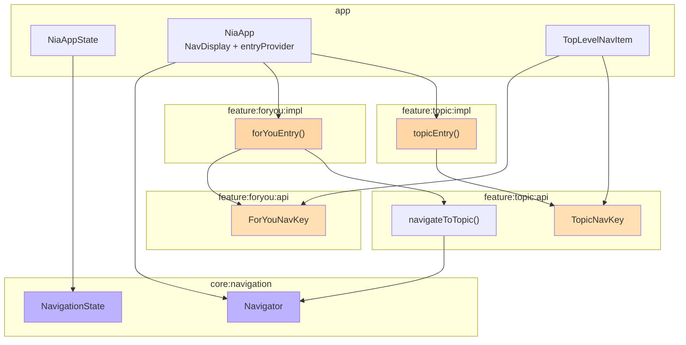
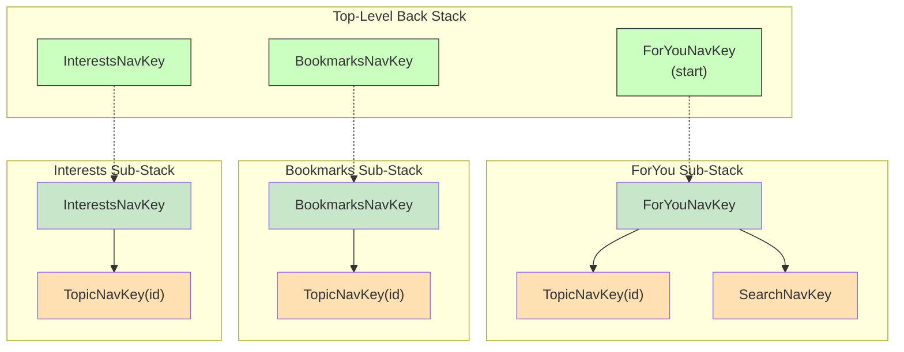
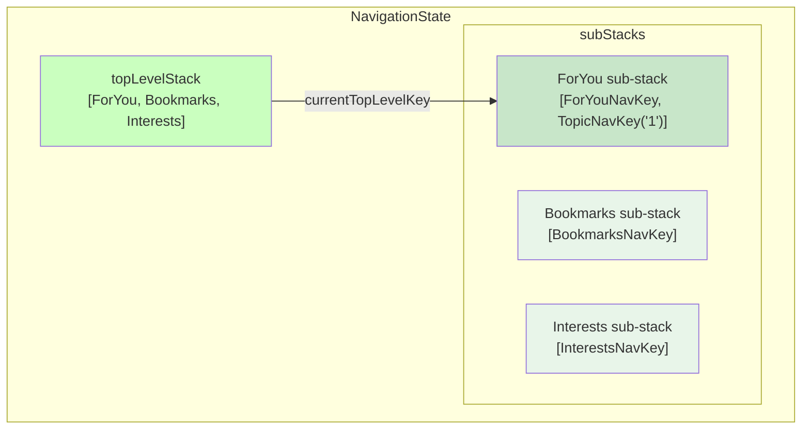
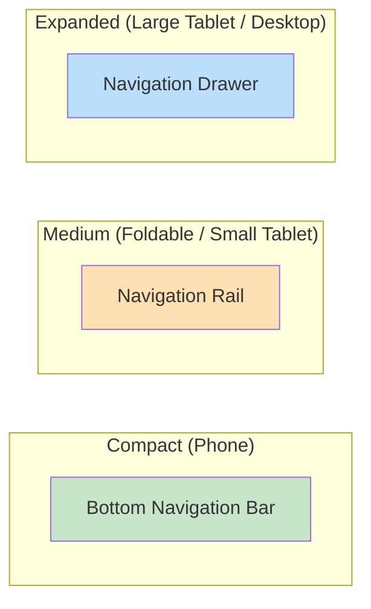
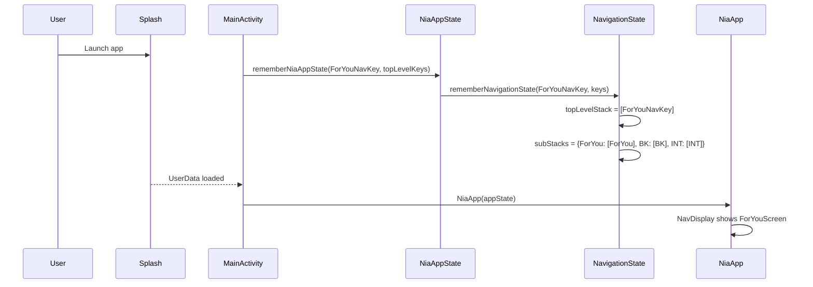
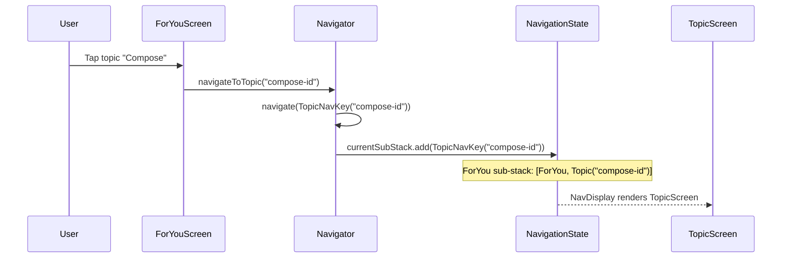
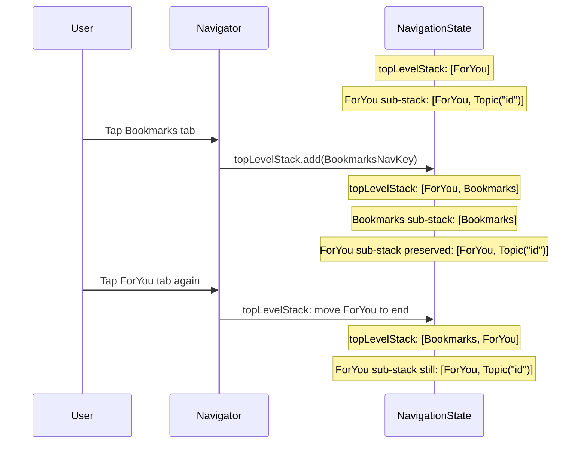
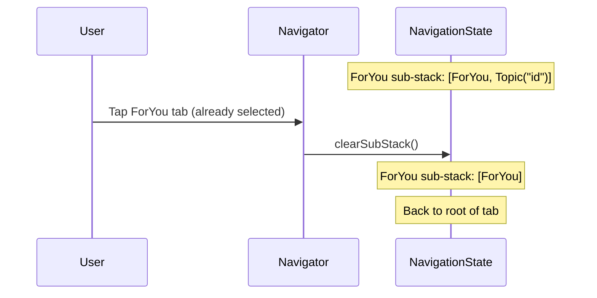
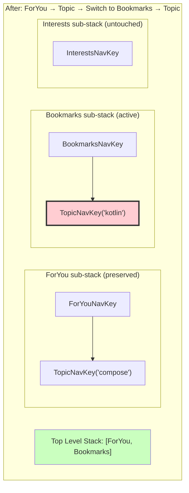

# Chapter 8 — Navigation (Comprehensive Guide)

## Navigation Philosophy

NiA uses **Jetpack Navigation 3** — the latest navigation library from Google, based on type-safe `NavKey` objects rather than string-based routes. This chapter is the most detailed in the documentation because navigation architecture is critical to scalability.

### Why Navigation 3?

| Feature | Navigation 2 (Compose) | Navigation 3 |
|---------|----------------------|---------------|
| Route definition | String-based routes | Type-safe `NavKey` objects |
| Argument passing | URL-encoded strings | Kotlin properties on `NavKey` |
| Entry definition | `NavGraphBuilder.composable()` | `EntryProviderScope.entry<T>()` |
| Back stack | `NavController` manages | `NavigationState` with explicit stacks |
| Serialization | Custom type converters | `@Serializable` on `NavKey` |
| ViewModel scoping | Nav graph scoping | `rememberViewModelStoreNavEntryDecorator` |

### Benefits of NiA's Approach

1. **Feature isolation** — Each feature defines its `NavKey` in the `api` module and its entry in the `impl` module
2. **No string routes** — Type-safe keys with compile-time checked arguments
3. **Multiple back stacks** — Each top-level destination has its own back stack
4. **Centralized navigation logic** — `Navigator` class handles all transitions
5. **State preservation** — `rememberNavBackStack` survives config changes and process death

---

## Navigation Modules



| Module | Responsibility |
|--------|---------------|
| `core:navigation` | `Navigator`, `NavigationState`, `rememberNavigationState()`, `toEntries()` |
| `feature:*:api` | `NavKey` definitions and navigation extension functions |
| `feature:*:impl` | `EntryProviderScope` extensions (entry providers) |
| `app` | `NiaAppState`, `NiaApp`, `TopLevelNavItem`, wiring everything together |

---

## App Navigation Graph



---

## Root Navigation Architecture

### MainActivity

Single activity architecture. `MainActivity` is annotated with `@AndroidEntryPoint` for Hilt. Its `onCreate` does:

1. Install splash screen (shows while `MainActivityUiState` loads)
2. Set up edge-to-edge
3. Create `NiaAppState` via `rememberNiaAppState()`
4. Provide `CompositionLocal` values (analytics, timezone)
5. Apply theme (`NiaTheme`)
6. Render `NiaApp(appState)`

### NiaApp

Root composable that assembles the entire UI:

```kotlin
@Composable
fun NiaApp(appState: NiaAppState) {
    NiaBackground {
        NiaGradientBackground(/* conditional gradient */) {
            val snackbarHostState = remember { SnackbarHostState() }
            val navigator = remember { Navigator(appState.navigationState) }

            NiaNavigationSuiteScaffold(
                navigationSuiteItems = {
                    TOP_LEVEL_NAV_ITEMS.forEach { (navKey, navItem) ->
                        item(
                            selected = navKey == appState.navigationState.currentTopLevelKey,
                            onClick = { navigator.navigate(navKey) },
                            // ...
                        )
                    }
                },
            ) {
                Scaffold(/* ... */) { padding ->
                    Column {
                        // Top app bar (only on top-level destinations)
                        if (currentKey in topLevelKeys) {
                            NiaTopAppBar(/* ... */)
                        }

                        // Navigation display
                        val entryProvider = entryProvider {
                            forYouEntry(navigator)
                            bookmarksEntry(navigator)
                            interestsEntry(navigator)
                            topicEntry(navigator)
                            searchEntry(navigator)
                        }

                        NavDisplay(
                            entries = appState.navigationState.toEntries(entryProvider),
                            sceneStrategy = listDetailStrategy,
                            onBack = { navigator.goBack() },
                        )
                    }
                }
            }
        }
    }
}
```

### NiaAppState

Centralized state holder for the app:

```kotlin
@Stable
class NiaAppState(
    val navigationState: NavigationState,
    coroutineScope: CoroutineScope,
    networkMonitor: NetworkMonitor,
    userNewsResourceRepository: UserNewsResourceRepository,
    timeZoneMonitor: TimeZoneMonitor,
) {
    val isOffline = networkMonitor.isOnline.map(Boolean::not).stateIn(/* ... */)

    val topLevelNavKeysWithUnreadResources: StateFlow<Set<NavKey>> =
        userNewsResourceRepository.observeAllForFollowedTopics()
            .combine(userNewsResourceRepository.observeAllBookmarked()) { forYou, bookmarks ->
                setOfNotNull(
                    ForYouNavKey.takeIf { forYou.any { !it.hasBeenViewed } },
                    BookmarksNavKey.takeIf { bookmarks.any { !it.hasBeenViewed } },
                )
            }.stateIn(/* ... */)

    val currentTimeZone = timeZoneMonitor.currentTimeZone.stateIn(/* ... */)
}
```

**Why `NiaAppState` exists:**
- Centralizes cross-cutting UI concerns (network status, unread badges, timezone)
- Keeps `NiaApp` composable clean
- Survives recomposition via `remember`
- Marked `@Stable` to prevent unnecessary recomposition

---

## NavigationState

The core navigation state holder:

```kotlin
class NavigationState(
    val startKey: NavKey,
    val topLevelStack: NavBackStack<NavKey>,
    val subStacks: Map<NavKey, NavBackStack<NavKey>>,
) {
    val currentTopLevelKey: NavKey by derivedStateOf { topLevelStack.last() }
    val topLevelKeys get() = subStacks.keys
    val currentSubStack: NavBackStack<NavKey>
        get() = subStacks[currentTopLevelKey] ?: error("...")
    val currentKey: NavKey by derivedStateOf { currentSubStack.last() }
}
```

**Architecture:**



- **`topLevelStack`** — Ordered list of visited top-level keys. Last = current tab.
- **`subStacks`** — Each top-level key has its own back stack. When you navigate within a tab, entries are added to that tab's sub-stack.
- **`currentTopLevelKey`** — Derived from `topLevelStack.last()`
- **`currentKey`** — The innermost key (last item in current sub-stack)

---

## Navigator

Handles all navigation transitions:

```kotlin
class Navigator(val state: NavigationState) {

    fun navigate(key: NavKey) {
        when (key) {
            state.currentTopLevelKey -> clearSubStack()    // Re-tap same tab
            in state.topLevelKeys -> goToTopLevel(key)     // Switch tab
            else -> goToKey(key)                            // Push detail
        }
    }

    fun goBack() {
        when (state.currentKey) {
            state.startKey -> error("Cannot go back from start")
            state.currentTopLevelKey -> state.topLevelStack.removeLastOrNull()
            else -> state.currentSubStack.removeLastOrNull()
        }
    }

    private fun goToKey(key: NavKey) {
        state.currentSubStack.apply {
            remove(key)  // Deduplicate
            add(key)
        }
    }

    private fun goToTopLevel(key: NavKey) {
        state.topLevelStack.apply {
            if (key == state.startKey) clear()
            else remove(key)
            add(key)
        }
    }

    private fun clearSubStack() {
        state.currentSubStack.run {
            if (size > 1) subList(1, size).clear()
        }
    }
}
```

**Navigation behavior:**
- **Tap same tab** — Clears sub-stack back to root
- **Switch tab** — Moves that tab to top of `topLevelStack`, preserves its sub-stack
- **Push detail** — Adds key to current tab's sub-stack
- **Back from detail** — Pops current sub-stack
- **Back from tab root** — Pops `topLevelStack` (returns to previous tab)

---

## Route Definitions (NavKeys)

Each feature defines its `NavKey` in its `api` module:

```kotlin
// feature:foryou:api — no arguments (singleton)
@Serializable
object ForYouNavKey : NavKey

// feature:bookmarks:api — no arguments (singleton)
@Serializable
object BookmarksNavKey : NavKey

// feature:search:api — no arguments (singleton)
@Serializable
object SearchNavKey : NavKey

// feature:interests:api — optional argument
@Serializable
data class InterestsNavKey(
    val initialTopicId: String? = null,
) : NavKey

// feature:topic:api — required argument
@Serializable
data class TopicNavKey(val id: String) : NavKey
```

**Conventions:**
- `@Serializable` — Required for state saving/restoration
- `object` — For destinations with no arguments
- `data class` — For destinations with arguments (type-safe, compile-time checked)
- Navigation extensions on `Navigator`:

```kotlin
// In feature:topic:api
fun Navigator.navigateToTopic(topicId: String) {
    navigate(TopicNavKey(topicId))
}
```

---

## Feature Entry Providers

Each feature's `impl` module defines an entry provider:

```kotlin
// feature:foryou:impl
fun EntryProviderScope<NavKey>.forYouEntry(navigator: Navigator) {
    entry<ForYouNavKey> {
        ForYouScreen(
            onTopicClick = navigator::navigateToTopic,
        )
    }
}

// feature:topic:impl — with arguments and list-detail scene
@OptIn(ExperimentalMaterial3AdaptiveApi::class)
fun EntryProviderScope<NavKey>.topicEntry(navigator: Navigator) {
    entry<TopicNavKey>(
        metadata = ListDetailSceneStrategy.detailPane(),
    ) { key ->
        val id = key.id
        TopicScreen(
            showBackButton = true,
            onBackClick = { navigator.goBack() },
            onTopicClick = navigator::navigateToTopic,
            viewModel = hiltViewModel<TopicViewModel, TopicViewModel.Factory>(
                key = id,
            ) { factory -> factory.create(id) },
        )
    }
}
```

**Key patterns:**
- `entry<T>` — Registers a handler for a specific `NavKey` type
- `key` parameter — The actual `NavKey` instance with arguments
- `navigator::navigateToTopic` — Navigation callbacks passed as lambdas
- `hiltViewModel` with `AssistedFactory` — For ViewModels with runtime arguments
- `metadata = ListDetailSceneStrategy.detailPane()` — Marks entries for adaptive layouts

---

## Adaptive Navigation

NiA uses `NiaNavigationSuiteScaffold` for adaptive navigation that responds to screen size:



The `windowAdaptiveInfo` parameter from `currentWindowAdaptiveInfo()` determines which layout to use. The navigation suite scaffold handles this automatically.

---

## Top-Level Destinations

```kotlin
val TOP_LEVEL_NAV_ITEMS = mapOf(
    ForYouNavKey to FOR_YOU,
    BookmarksNavKey to BOOKMARKS,
    InterestsNavKey(null) to INTERESTS,
)

data class TopLevelNavItem(
    val selectedIcon: ImageVector,
    val unselectedIcon: ImageVector,
    @StringRes val iconTextId: Int,
    @StringRes val titleTextId: Int,
)
```

This map defines which `NavKey` objects appear in the bottom navigation bar, their icons, and labels.

---

## Navigation Flow: User Journey

### App Launch



### Navigating to Topic from ForYou



### Switching Tabs



**Key:** Sub-stacks are **preserved** when switching tabs. Returning to ForYou shows the Topic detail you were on.

### Re-tapping Current Tab



---

## Back Stack Visualization



`BK2` (TopicNavKey 'kotlin') is the **current visible destination**.

**Back navigation from here:**
1. Press back: BK sub-stack pops TopicNavKey, shows BookmarksNavKey
2. Press back: topLevelStack pops Bookmarks, goes back to ForYou
3. ForYou sub-stack still has [ForYou, Topic('compose')], shows Topic
4. Press back: ForYou sub-stack pops Topic, shows ForYou root
5. Press back: Cannot go back from start key — app exits

---

## How to Add a New Navigation Destination

### Step-by-Step Tutorial

**Goal:** Add a "Profile" feature with navigation.

#### Step 1: Create Feature API Module

Create `feature/profile/api/build.gradle.kts`:

```kotlin
plugins {
    alias(libs.plugins.nowinandroid.android.feature.api)
}

android {
    namespace = "com.google.samples.apps.nowinandroid.feature.profile.api"
}
```

#### Step 2: Define NavKey

Create `feature/profile/api/src/.../navigation/ProfileNavKey.kt`:

```kotlin
@Serializable
data class ProfileNavKey(val userId: String) : NavKey

fun Navigator.navigateToProfile(userId: String) {
    navigate(ProfileNavKey(userId))
}
```

#### Step 3: Create Feature Impl Module

Create `feature/profile/impl/build.gradle.kts`:

```kotlin
plugins {
    alias(libs.plugins.nowinandroid.android.feature.impl)
    alias(libs.plugins.nowinandroid.android.library.compose)
}

android {
    namespace = "com.google.samples.apps.nowinandroid.feature.profile.impl"
}

dependencies {
    implementation(projects.core.data)
    implementation(projects.feature.profile.api)
}
```

#### Step 4: Create ViewModel

```kotlin
@HiltViewModel(assistedFactory = ProfileViewModel.Factory::class)
class ProfileViewModel @AssistedInject constructor(
    private val userDataRepository: UserDataRepository,
    @Assisted val userId: String,
) : ViewModel() {

    val uiState: StateFlow<ProfileUiState> = /* ... */

    @AssistedFactory
    interface Factory {
        fun create(userId: String): ProfileViewModel
    }
}
```

#### Step 5: Create Screen

```kotlin
@Composable
fun ProfileScreen(
    onBackClick: () -> Unit,
    viewModel: ProfileViewModel,
) {
    val uiState by viewModel.uiState.collectAsStateWithLifecycle()
    // Render UI
}
```

#### Step 6: Create Entry Provider

Create `feature/profile/impl/src/.../navigation/ProfileEntryProvider.kt`:

```kotlin
fun EntryProviderScope<NavKey>.profileEntry(navigator: Navigator) {
    entry<ProfileNavKey> { key ->
        ProfileScreen(
            onBackClick = { navigator.goBack() },
            viewModel = hiltViewModel<ProfileViewModel, ProfileViewModel.Factory>(
                key = key.userId,
            ) { factory -> factory.create(key.userId) },
        )
    }
}
```

#### Step 7: Register in settings.gradle.kts

```kotlin
include(":feature:profile:api")
include(":feature:profile:impl")
```

#### Step 8: Register in NiaApp

In `NiaApp.kt`, add to `entryProvider`:

```kotlin
val entryProvider = entryProvider {
    forYouEntry(navigator)
    bookmarksEntry(navigator)
    interestsEntry(navigator)
    topicEntry(navigator)
    searchEntry(navigator)
    profileEntry(navigator)  // ADD THIS
}
```

#### Step 9: Add to app/build.gradle.kts

```kotlin
dependencies {
    implementation(projects.feature.profile.impl)
}
```

#### Step 10: Use Navigation from Other Features

In any feature's `api` module that needs to navigate to profile:

```kotlin
// Already done in Step 2 — other features depend on profile:api
fun Navigator.navigateToProfile(userId: String) {
    navigate(ProfileNavKey(userId))
}
```

#### Optional: Add as Top-Level Destination

Add to `TopLevelNavItem.kt`:

```kotlin
val PROFILE = TopLevelNavItem(
    selectedIcon = NiaIcons.Person,
    unselectedIcon = NiaIcons.PersonBorder,
    iconTextId = R.string.profile,
    titleTextId = R.string.profile,
)

val TOP_LEVEL_NAV_ITEMS = mapOf(
    ForYouNavKey to FOR_YOU,
    BookmarksNavKey to BOOKMARKS,
    InterestsNavKey(null) to INTERESTS,
    ProfileNavKey("self") to PROFILE,  // ADD THIS
)
```

And update `rememberNavigationState()` call in `NiaAppState`.

---

## How to Add Nested Navigation

For a feature with multiple sub-screens (e.g., Settings with sub-pages):

```kotlin
// Define multiple NavKeys
@Serializable object SettingsRootNavKey : NavKey
@Serializable object SettingsAboutNavKey : NavKey
@Serializable object SettingsPrivacyNavKey : NavKey

// Entry provider handles all keys
fun EntryProviderScope<NavKey>.settingsEntries(navigator: Navigator) {
    entry<SettingsRootNavKey> {
        SettingsRootScreen(
            onAboutClick = { navigator.navigate(SettingsAboutNavKey) },
            onPrivacyClick = { navigator.navigate(SettingsPrivacyNavKey) },
        )
    }
    entry<SettingsAboutNavKey> {
        SettingsAboutScreen(onBackClick = { navigator.goBack() })
    }
    entry<SettingsPrivacyNavKey> {
        SettingsPrivacyScreen(onBackClick = { navigator.goBack() })
    }
}
```

All sub-screens are pushed onto the same tab's sub-stack.

---

## How to Add an Authentication Flow

```kotlin
// Auth nav keys
@Serializable object LoginNavKey : NavKey
@Serializable data class OtpNavKey(val phone: String) : NavKey
@Serializable object HomeNavKey : NavKey

// In Navigator or a custom AuthNavigator:
fun completeAuth(navigator: Navigator) {
    // Clear auth screens from back stack, navigate to home
    navigator.state.currentSubStack.apply {
        // Remove login and OTP entries
        removeAll { it is LoginNavKey || it is OtpNavKey }
    }
    navigator.navigate(HomeNavKey)
}
```

**Pattern:** After authentication succeeds, remove auth-related keys from the back stack so the user cannot "back" into the login screen.

---

## Navigation Best Practices

| Practice | Rationale |
|----------|-----------|
| Define `NavKey` in `api` module | Enables cross-feature navigation without coupling |
| Use `@Serializable` on all `NavKey` types | Required for state saving |
| Pass `Navigator` to entry providers, not to ViewModels | Keeps ViewModels navigation-free |
| Use `object` for argument-less destinations | Simpler, singleton |
| Use `data class` for destinations with arguments | Type-safe, compile-time checked |
| Handle back navigation in entry provider | `onBackClick = { navigator.goBack() }` |
| Never call `navigator.navigate()` from ViewModel | Navigation is a UI concern |

---

## Summary

NiA's navigation architecture uses Navigation 3 with type-safe `NavKey` objects, multiple back stacks for top-level destinations, and a centralized `Navigator` that manages all transitions. Features remain decoupled through the `api/impl` module split.

## Key Takeaways

- `NavigationState` manages a stack of top-level keys, each with its own sub-stack
- `Navigator` handles forward navigation, back, tab switching, and stack clearing
- Features define `NavKey` in `api`, entry provider in `impl`
- `NavDisplay` + `entryProvider` renders the current back stack
- Sub-stacks are preserved when switching tabs

## Best Practices

- Always define `NavKey` in the `api` module
- Use `@Serializable` for process death survival
- Pass `Navigator` only to entry providers, not to ViewModels
- Use `AssistedInject` for ViewModels that need `NavKey` arguments

## Common Mistakes

- **Putting navigation logic in ViewModels** — Navigation events should be lambdas from entry providers
- **Forgetting `@Serializable`** — Navigation state won't survive process death
- **Making feature `impl` depend on another feature `impl`** — Use `api` modules
- **Not registering entry in `entryProvider`** — App crashes on navigation to unknown key
