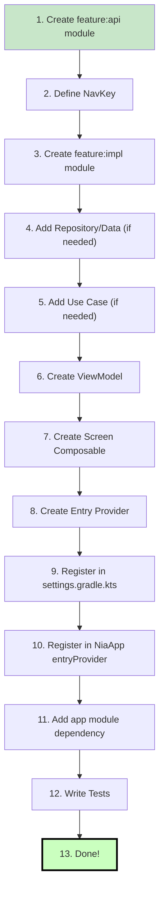

# Chapter 9 — Feature Development Guide

## Overview

This chapter is a practical, step-by-step tutorial for adding a new feature to Now in Android. By following these steps, you will create a feature that is architecturally consistent with existing features.

---

## The Complete Feature Checklist



---

## Example: Adding a "Notifications" Feature

We will add a screen that shows the user's notification history.

### Step 1: Create `feature:notifications:api` Module

**File: `feature/notifications/api/build.gradle.kts`**

```kotlin
plugins {
    alias(libs.plugins.nowinandroid.android.feature.api)
}

android {
    namespace = "com.google.samples.apps.nowinandroid.feature.notifications.api"
}
```

**What the `nowinandroid.android.feature.api` plugin does:**
- Applies `nowinandroid.android.library`
- Applies Kotlin serialization plugin
- Adds `api(project(":core:navigation"))` dependency

### Step 2: Define NavKey

**File: `feature/notifications/api/src/.../navigation/NotificationsNavKey.kt`**

```kotlin
package com.google.samples.apps.nowinandroid.feature.notifications.api.navigation

import androidx.navigation3.runtime.NavKey
import kotlinx.serialization.Serializable

@Serializable
object NotificationsNavKey : NavKey
```

No arguments needed — use `object`. If it needed arguments (e.g., a notification ID), use `data class`.

### Step 3: Create `feature:notifications:impl` Module

**File: `feature/notifications/impl/build.gradle.kts`**

```kotlin
plugins {
    alias(libs.plugins.nowinandroid.android.feature.impl)
    alias(libs.plugins.nowinandroid.android.library.compose)
    alias(libs.plugins.nowinandroid.android.library.jacoco)
}

android {
    namespace = "com.google.samples.apps.nowinandroid.feature.notifications.impl"
}

dependencies {
    implementation(projects.core.data)
    implementation(projects.feature.notifications.api)

    testImplementation(projects.core.testing)
}
```

**What the `nowinandroid.android.feature.impl` plugin does:**
- Applies `nowinandroid.android.library`
- Applies `nowinandroid.hilt`
- Adds dependencies: `core:ui`, `core:designsystem`, lifecycle, viewmodel-compose, navigation3, tracing

### Step 4: Add Data Layer (if new data is needed)

If the feature needs new data not provided by existing repositories, add it to `core:data`:

**Interface:**

```kotlin
// core/data/src/.../repository/NotificationsRepository.kt
interface NotificationsRepository {
    fun getNotifications(): Flow<List<Notification>>
    suspend fun markAsRead(notificationId: String)
}
```

**Implementation:**

```kotlin
// core/data/src/.../repository/OfflineFirstNotificationsRepository.kt
internal class OfflineFirstNotificationsRepository @Inject constructor(
    private val notificationDao: NotificationDao,
) : NotificationsRepository {
    override fun getNotifications(): Flow<List<Notification>> =
        notificationDao.getAll().map { it.map(NotificationEntity::asExternalModel) }

    override suspend fun markAsRead(notificationId: String) =
        notificationDao.markAsRead(notificationId)
}
```

**Hilt binding:**

```kotlin
// In DataModule
@Binds
internal abstract fun bindsNotificationsRepository(
    impl: OfflineFirstNotificationsRepository,
): NotificationsRepository
```

For this example, we will use existing `UserNewsResourceRepository` instead.

### Step 5: Create Use Case (if needed)

Only if the same data transformation is needed by 2+ ViewModels:

```kotlin
class GetUnreadNotificationsUseCase @Inject constructor(
    private val userNewsResourceRepository: UserNewsResourceRepository,
) {
    operator fun invoke(): Flow<List<UserNewsResource>> =
        userNewsResourceRepository.observeAll()
            .map { resources -> resources.filter { !it.hasBeenViewed } }
}
```

### Step 6: Create ViewModel

**File: `feature/notifications/impl/src/.../NotificationsViewModel.kt`**

```kotlin
@HiltViewModel
class NotificationsViewModel @Inject constructor(
    private val userDataRepository: UserDataRepository,
    userNewsResourceRepository: UserNewsResourceRepository,
) : ViewModel() {

    val uiState: StateFlow<NotificationsUiState> =
        userNewsResourceRepository.observeAll()
            .map { resources ->
                NotificationsUiState.Success(
                    notifications = resources.filter { !it.hasBeenViewed },
                )
            }
            .stateIn(
                scope = viewModelScope,
                started = SharingStarted.WhileSubscribed(5_000),
                initialValue = NotificationsUiState.Loading,
            )

    fun markAsViewed(newsResourceId: String) {
        viewModelScope.launch {
            userDataRepository.setNewsResourceViewed(newsResourceId, true)
        }
    }
}

sealed interface NotificationsUiState {
    data object Loading : NotificationsUiState
    data class Success(val notifications: List<UserNewsResource>) : NotificationsUiState
}
```

### Step 7: Create Screen Composable

**File: `feature/notifications/impl/src/.../NotificationsScreen.kt`**

```kotlin
@Composable
fun NotificationsScreen(
    onBackClick: () -> Unit,
    onNewsResourceClick: (String) -> Unit,
    viewModel: NotificationsViewModel = hiltViewModel(),
) {
    val uiState by viewModel.uiState.collectAsStateWithLifecycle()

    NotificationsScreen(
        uiState = uiState,
        onBackClick = onBackClick,
        onNewsResourceClick = onNewsResourceClick,
        onMarkAsViewed = viewModel::markAsViewed,
    )
}

@Composable
internal fun NotificationsScreen(
    uiState: NotificationsUiState,
    onBackClick: () -> Unit,
    onNewsResourceClick: (String) -> Unit,
    onMarkAsViewed: (String) -> Unit,
) {
    when (uiState) {
        NotificationsUiState.Loading -> {
            // Show loading indicator
        }
        is NotificationsUiState.Success -> {
            LazyColumn {
                items(uiState.notifications) { notification ->
                    // Render notification card
                }
            }
        }
    }
}
```

### Step 8: Create Entry Provider

**File: `feature/notifications/impl/src/.../navigation/NotificationsEntryProvider.kt`**

```kotlin
fun EntryProviderScope<NavKey>.notificationsEntry(navigator: Navigator) {
    entry<NotificationsNavKey> {
        NotificationsScreen(
            onBackClick = { navigator.goBack() },
            onNewsResourceClick = { id ->
                navigator.navigate(TopicNavKey(id))
            },
        )
    }
}
```

### Step 9: Register Modules in settings.gradle.kts

```kotlin
include(":feature:notifications:api")
include(":feature:notifications:impl")
```

### Step 10: Register Entry in NiaApp

In `NiaApp.kt`:

```kotlin
import com.google.samples.apps.nowinandroid.feature.notifications.impl.navigation.notificationsEntry

// In the entryProvider block:
val entryProvider = entryProvider {
    forYouEntry(navigator)
    bookmarksEntry(navigator)
    interestsEntry(navigator)
    topicEntry(navigator)
    searchEntry(navigator)
    notificationsEntry(navigator)  // ADD THIS
}
```

### Step 11: Add Dependency in app/build.gradle.kts

```kotlin
dependencies {
    implementation(projects.feature.notifications.impl)
}
```

### Step 12: Write Tests

**ViewModel test:**

```kotlin
class NotificationsViewModelTest {
    @get:Rule
    val dispatcherRule = TestDispatcherRule()

    private val userNewsResourceRepository = TestUserNewsResourceRepository()
    private val userDataRepository = TestUserDataRepository()

    private lateinit var viewModel: NotificationsViewModel

    @Before
    fun setup() {
        viewModel = NotificationsViewModel(
            userDataRepository = userDataRepository,
            userNewsResourceRepository = userNewsResourceRepository,
        )
    }

    @Test
    fun initialState_isLoading() = runTest {
        assertEquals(NotificationsUiState.Loading, viewModel.uiState.value)
    }

    @Test
    fun whenDataAvailable_stateIsSuccess() = runTest {
        userNewsResourceRepository.sendNewsResources(sampleResources)
        viewModel.uiState.test {
            val state = awaitItem()
            assertTrue(state is NotificationsUiState.Success)
        }
    }
}
```

---

## Files Changed Summary

| File | Action | Why |
|------|--------|-----|
| `feature/notifications/api/build.gradle.kts` | Create | API module configuration |
| `feature/notifications/api/.../NotificationsNavKey.kt` | Create | Navigation contract |
| `feature/notifications/impl/build.gradle.kts` | Create | Impl module configuration |
| `feature/notifications/impl/.../NotificationsViewModel.kt` | Create | State holder |
| `feature/notifications/impl/.../NotificationsScreen.kt` | Create | UI |
| `feature/notifications/impl/.../NotificationsEntryProvider.kt` | Create | Navigation wiring |
| `settings.gradle.kts` | Modify | Register new modules |
| `app/src/.../ui/NiaApp.kt` | Modify | Register entry provider |
| `app/build.gradle.kts` | Modify | Add impl dependency |

---

## Summary

Adding a feature follows a predictable pattern: define the contract (NavKey), implement the logic (ViewModel + Screen), wire the navigation (entry provider), and register everything (settings.gradle.kts + NiaApp).

## Key Takeaways

- Every feature has `api` (NavKey) and `impl` (everything else)
- Convention plugins handle 90% of Gradle configuration
- Entry providers bridge navigation and feature UI
- ViewModel receives lambdas for navigation, not `Navigator` directly

## Best Practices

- Follow the exact naming convention: `<Feature>NavKey`, `<Feature>ViewModel`, `<Feature>Screen`, `<feature>Entry()`
- Create the `api` module first, then `impl`
- Test with fake repositories from `core:data-test`
- Keep entry providers minimal — just wiring, no business logic

## Common Mistakes

- **Forgetting to register in `settings.gradle.kts`** — Build fails silently or module not found
- **Not adding the entry to `entryProvider` in NiaApp** — App crashes on navigation
- **Creating ViewModel before defining NavKey** — Unclear what arguments are needed
- **Skipping the stateful/stateless composable split** — Makes testing harder
