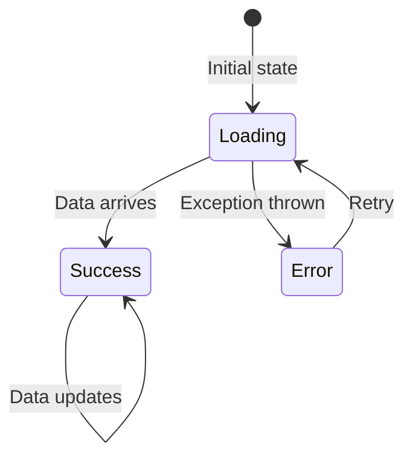

# Chapter 10 — State Management

## Overview

NiA uses a consistent state management pattern across all features: **sealed state hierarchies** exposed as `StateFlow` from ViewModels, collected with lifecycle awareness in Composables.

---

## State Architecture

```mermaid
graph LR
    REPO["Repository<br/>Flow<Data>"] -->|combines/transforms| VM["ViewModel"]
    VM -->|stateIn()| SF["StateFlow<UiState>"]
    SF -->|collectAsStateWithLifecycle| UI["Composable"]
    UI -->|user events| VM

    style REPO fill:#BBDEFB
    style VM fill:#FFE0B2
    style SF fill:#FFF9C4
    style UI fill:#C8E6C9
```

---

## StateFlow Pattern

Every ViewModel follows this pattern:

```kotlin
val uiState: StateFlow<UiState> = repository
    .observeSomething()                    // Cold Flow from repository
    .map { data -> UiState.Success(data) } // Transform to UI state
    .stateIn(                               // Convert to hot StateFlow
        scope = viewModelScope,
        started = SharingStarted.WhileSubscribed(5_000),
        initialValue = UiState.Loading,
    )
```

**Why `stateIn()`:**
- Converts cold `Flow` to hot `StateFlow`
- `StateFlow` always has a value (`initialValue`)
- Composables can read `.value` synchronously

**Why `WhileSubscribed(5_000)`:**
- Stops upstream collection 5 seconds after last collector disappears
- Handles configuration changes: Activity is destroyed and recreated within 5 seconds
- Avoids wasting resources when truly no one is listening

---

## Sealed State Hierarchies

UI state is always modeled as a sealed hierarchy:

```kotlin
sealed interface TopicUiState {
    data object Loading : TopicUiState
    data class Success(val followableTopic: FollowableTopic) : TopicUiState
    data object Error : TopicUiState
}
```

**Why sealed interfaces:**
- Compiler enforces exhaustive `when` expressions
- Each state carries exactly the data it needs
- No nullable fields or boolean flags

**State machine:**



### Combining Multiple States

When a screen has multiple independent data sources:

```kotlin
@HiltViewModel
class TopicViewModel @AssistedInject constructor(/* ... */) : ViewModel() {

    val topicUiState: StateFlow<TopicUiState> = /* ... */
    val newsUiState: StateFlow<NewsUiState> = /* ... */
}
```

Each sub-state has its own `StateFlow`. The Composable collects both:

```kotlin
@Composable
fun TopicScreen(viewModel: TopicViewModel) {
    val topicState by viewModel.topicUiState.collectAsStateWithLifecycle()
    val newsState by viewModel.newsUiState.collectAsStateWithLifecycle()

    when (topicState) {
        TopicUiState.Loading -> LoadingIndicator()
        is TopicUiState.Success -> TopicContent(topicState.followableTopic)
        TopicUiState.Error -> ErrorMessage()
    }
}
```

**Tradeoff:** Multiple `StateFlow`s vs single combined state. NiA uses multiple flows when sub-states are independent (topic info vs news list can load separately). Use a single flow when all data must be present together.

---

## The Result Wrapper

NiA includes a `Result` wrapper for `Flow` error handling:

```kotlin
sealed interface Result<out T> {
    data class Success<T>(val data: T) : Result<T>
    data class Error(val exception: Throwable) : Result<Nothing>
    data object Loading : Result<Nothing>
}

fun <T> Flow<T>.asResult(): Flow<Result<T>> =
    map<T, Result<T>> { Result.Success(it) }
        .onStart { emit(Result.Loading) }
        .catch { emit(Result.Error(it)) }
```

**Usage:**

```kotlin
combine(followedTopicIds, topicStream, ::Pair)
    .asResult()
    .map { result ->
        when (result) {
            is Result.Success -> TopicUiState.Success(result.data)
            is Result.Loading -> TopicUiState.Loading
            is Result.Error -> TopicUiState.Error
        }
    }
```

This pattern converts any `Flow` into a state machine that handles Loading, Success, and Error automatically.

---

## Event Handling

NiA uses **direct method calls** for events — no event classes, no `Channel`, no `SharedFlow`:

```kotlin
// ViewModel
fun bookmarkNews(newsResourceId: String, bookmarked: Boolean) {
    viewModelScope.launch {
        userDataRepository.setNewsResourceBookmarked(newsResourceId, bookmarked)
    }
}

// Composable
Button(onClick = { viewModel.bookmarkNews(id, true) }) {
    Text("Bookmark")
}
```

**Why no event channel:**
- Events in NiA are fire-and-forget write operations
- No need for one-time consumption semantics
- Simpler code, fewer abstractions
- The state change propagates through the reactive chain automatically

---

## Immutability

All UI state objects are immutable:

```kotlin
// ✅ Correct — immutable data class
data class Success(val followableTopic: FollowableTopic) : TopicUiState

// ❌ Wrong — mutable state
class Success(var followableTopic: FollowableTopic) : TopicUiState
```

**Why immutability:**
- Compose uses structural equality for recomposition skipping
- Thread-safe without synchronization
- Predictable — each emission is a complete snapshot
- Easier debugging — state at any point is a single object

---

## SavedStateHandle

For ViewModels that need to survive process death with ephemeral state:

```kotlin
@HiltViewModel
class ForYouViewModel @Inject constructor(
    private val savedStateHandle: SavedStateHandle,
    // ...
) : ViewModel() {

    val deepLinkedNewsResource = savedStateHandle
        .getStateFlow<String?>(DEEP_LINK_NEWS_RESOURCE_ID_KEY, null)
        .flatMapLatest { newsResourceId ->
            if (newsResourceId == null) flowOf(emptyList())
            else userNewsResourceRepository.observeAll(
                NewsResourceQuery(filterNewsIds = setOf(newsResourceId)),
            )
        }
        .map { it.firstOrNull() }
        .stateIn(/* ... */)
}
```

`SavedStateHandle.getStateFlow()` creates a `StateFlow` backed by saved state. Changes survive process death.

---

## Summary

NiA's state management is simple and consistent: sealed state hierarchies, `StateFlow` with `WhileSubscribed`, lifecycle-aware collection, and direct method calls for events.

## Key Takeaways

- All state is `StateFlow` exposed from ViewModels
- `SharingStarted.WhileSubscribed(5_000)` handles config changes
- Sealed interfaces enforce exhaustive state handling
- Events are plain method calls, not channel or SharedFlow
- All state objects are immutable

## Best Practices

- Use `data object` for states without data (`Loading`, `Error`)
- Use `data class` for states with data (`Success`)
- Collect with `collectAsStateWithLifecycle()`, not `collectAsState()`
- Use `.asResult()` to convert any Flow into Loading/Success/Error

## Common Mistakes

- **Using `SharingStarted.Eagerly`** — Wastes resources even with no collectors
- **Using `MutableState` in ViewModel** — Use `StateFlow` for state holder pattern
- **Creating mutable UI state** — Always emit new immutable instances
- **Using `Channel` for navigation events** — Pass navigation as lambdas instead
