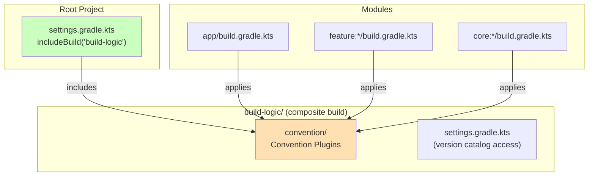

# Chapter 12 — Build Logic

## Overview

NiA uses a **composite build** (`build-logic/`) containing **convention plugins** that standardize Gradle configuration across 30+ modules. This eliminates copy-paste boilerplate and ensures every module is configured identically.

---

## Why Convention Plugins?

Without convention plugins, every module's `build.gradle.kts` would repeat:
- Compile SDK version
- Min SDK version
- Java/Kotlin target
- Compose configuration
- Hilt setup
- Test configurations
- Lint options

With 30+ modules, any change (like updating compile SDK) would require editing 30+ files. Convention plugins define these once.

---

## Architecture



---

## Convention Plugins

| Plugin ID | Purpose |
|-----------|---------|
| `nowinandroid.android.application` | Android app module (SDK, flavors, signing) |
| `nowinandroid.android.application.compose` | App module + Compose |
| `nowinandroid.android.application.firebase` | Firebase configuration |
| `nowinandroid.android.application.flavors` | Product flavors (`demo`/`prod`) |
| `nowinandroid.android.feature.api` | Feature API module (library + serialization + core:navigation) |
| `nowinandroid.android.feature.impl` | Feature impl module (library + Hilt + UI deps) |
| `nowinandroid.android.library` | Android library (SDK, Kotlin, lint) |
| `nowinandroid.android.library.compose` | Library + Compose |
| `nowinandroid.android.room` | Room database configuration |
| `nowinandroid.hilt` | Hilt + KSP |
| `nowinandroid.jvm.library` | Pure JVM library |
| `nowinandroid.android.lint` | Lint configuration |
| `nowinandroid.android.test` | Test module configuration |

---

## Feature API Plugin

```kotlin
class AndroidFeatureApiConventionPlugin : Plugin<Project> {
    override fun apply(target: Project) {
        with(target) {
            apply(plugin = "nowinandroid.android.library")
            apply(plugin = "org.jetbrains.kotlin.plugin.serialization")

            dependencies {
                "api"(project(":core:navigation"))
            }
        }
    }
}
```

**What this gives every feature API module:**
1. Standard Android library configuration
2. Kotlin serialization (for `@Serializable` NavKeys)
3. `core:navigation` as an `api` dependency (so consumers get `Navigator`, `NavKey`)

---

## Feature Impl Plugin

```kotlin
class AndroidFeatureImplConventionPlugin : Plugin<Project> {
    override fun apply(target: Project) {
        with(target) {
            apply(plugin = "nowinandroid.android.library")
            apply(plugin = "nowinandroid.hilt")

            dependencies {
                "implementation"(project(":core:ui"))
                "implementation"(project(":core:designsystem"))
                "implementation"(libs.findLibrary("androidx.lifecycle.runtimeCompose").get())
                "implementation"(libs.findLibrary("androidx.lifecycle.viewModelCompose").get())
                "implementation"(libs.findLibrary("androidx.hilt.lifecycle.viewModelCompose").get())
                "implementation"(libs.findLibrary("androidx.navigation3.runtime").get())
                "implementation"(libs.findLibrary("androidx.tracing.ktx").get())
            }
        }
    }
}
```

**What this gives every feature impl module:**
1. Standard Android library configuration
2. Hilt dependency injection
3. `core:ui` and `core:designsystem` for UI components
4. Lifecycle, ViewModel, Navigation 3, and tracing libraries

---

## Version Catalog

All dependency versions are managed in `gradle/libs.versions.toml`:

```toml
[versions]
compose = "1.7.0"
hilt = "2.51.1"
room = "2.6.1"

[libraries]
hilt-android = { group = "com.google.dagger", name = "hilt-android", version.ref = "hilt" }
hilt-compiler = { group = "com.google.dagger", name = "hilt-compiler", version.ref = "hilt" }

[plugins]
nowinandroid-android-feature-api = { id = "nowinandroid.android.feature.api" }
nowinandroid-android-feature-impl = { id = "nowinandroid.android.feature.impl" }
```

Convention plugins access the catalog via extension:

```kotlin
val Project.libs get() = the<LibrariesForLibs>()
```

---

## How a Module Build File Looks

**Minimal feature impl build file:**

```kotlin
plugins {
    alias(libs.plugins.nowinandroid.android.feature.impl)
    alias(libs.plugins.nowinandroid.android.library.compose)
    alias(libs.plugins.nowinandroid.android.library.jacoco)
}

android {
    namespace = "com.google.samples.apps.nowinandroid.feature.topic.impl"
}

dependencies {
    implementation(projects.core.data)
    implementation(projects.feature.topic.api)
    testImplementation(projects.core.testing)
}
```

Only 3 plugins and 3 custom dependencies. Everything else is handled by convention plugins.

---

## Adding a New Convention Plugin

1. Create the plugin class in `build-logic/convention/src/main/kotlin/`
2. Register it in `build-logic/convention/build.gradle.kts`:

```kotlin
gradlePlugin {
    plugins {
        register("androidFeatureApi") {
            id = "nowinandroid.android.feature.api"
            implementationClass = "AndroidFeatureApiConventionPlugin"
        }
    }
}
```

3. Reference in version catalog:

```toml
[plugins]
nowinandroid-android-feature-api = { id = "nowinandroid.android.feature.api" }
```

4. Apply in module: `alias(libs.plugins.nowinandroid.android.feature.api)`

---

## Summary

Convention plugins centralize build configuration, eliminating duplication across 30+ modules. The version catalog manages all dependency versions in one place.

## Key Takeaways

- `build-logic/` is a composite build included via `includeBuild("build-logic")`
- Each plugin type (app, library, feature api, feature impl, hilt) has its own convention plugin
- Version catalog (`libs.versions.toml`) manages all versions
- Module build files are minimal — most config comes from plugins

## Best Practices

- Always use convention plugins for new modules — never manual configuration
- Add new dependencies to version catalog first, then reference in plugins
- Keep convention plugins focused — one responsibility per plugin
- Use `apply(plugin = "nowinandroid.xxx")` for chaining plugins

## Common Mistakes

- **Duplicating configuration across modules** — Use a convention plugin instead
- **Adding version numbers in module build files** — Use version catalog
- **Not registering plugin in `build.gradle.kts`** — Plugin ID won't resolve
- **Modifying `build-logic/` without understanding the impact** — Changes affect ALL modules
