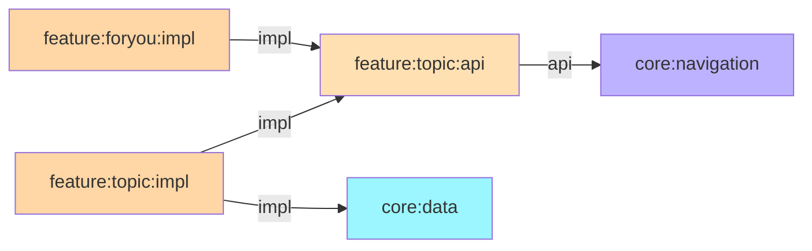
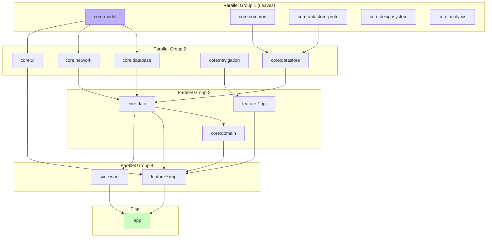

# Chapter 13 — Gradle Module Architecture

## Overview

NiA's module graph is carefully designed to maximize build parallelism, enforce clean boundaries, and keep compile times fast. This chapter explains module dependencies, API vs implementation visibility, and naming conventions.

---

## API vs Implementation Dependencies

| Keyword | Behavior |
|---------|----------|
| `api` | Dependency is visible to consumers of this module |
| `implementation` | Dependency is hidden from consumers |

**NiA's rules:**
- Feature `api` modules use `api` for `core:navigation` — so consumers get `NavKey` transitively
- Feature `impl` modules use `implementation` for everything — nothing leaks
- Core modules use `api` only when consumers genuinely need the transitive dependency



`feature:foryou:impl` depends on `feature:topic:api`, and through the `api` dependency, it transitively gets `core:navigation` — which provides `Navigator` and `NavKey`.

---

## Module Naming Conventions

| Pattern | Example | Usage |
|---------|---------|-------|
| `core:<name>` | `core:data`, `core:model` | Shared infrastructure |
| `feature:<name>:api` | `feature:topic:api` | Navigation contract |
| `feature:<name>:impl` | `feature:topic:impl` | Feature implementation |
| `sync:<name>` | `sync:work` | Background sync |
| `core:<name>-test` | `core:data-test` | Test fakes for a core module |

---

## Build Parallelism

Gradle builds independent modules in parallel. The more leaf modules, the better the parallelism:



**Key insight:** `core:model` is a JVM library with zero dependencies — it compiles first and fastest, unblocking 5+ modules that depend on it.

---

## Dependency Rules

| Rule | Rationale |
|------|-----------|
| No circular dependencies | Graph must be a DAG |
| `core` never depends on `feature` | Infrastructure doesn't know about features |
| Feature `impl` never depends on another feature `impl` | Prevents coupling |
| Feature `impl` may depend on other feature `api` | For cross-feature navigation |
| `app` depends on all feature `impl` and `sync` | Wires everything together |
| Tests may depend on `core:testing` and `core:data-test` | Shared test infrastructure |

---

## Typesafe Project Accessors

NiA enables typesafe project accessors in `settings.gradle.kts`:

```kotlin
enableFeaturePreview("TYPESAFE_PROJECT_ACCESSORS")
```

This allows:

```kotlin
// Instead of:
implementation(project(":core:data"))

// Use:
implementation(projects.core.data)
```

Compile-time checked, IDE autocomplete, no typos.

---

## Summary

NiA's module graph maximizes parallelism with leaf modules like `core:model`, enforces boundaries with `api`/`implementation` visibility, and uses typesafe project accessors for safety.

## Key Takeaways

- `api` exposes transitive dependencies; `implementation` hides them
- Feature `api` modules use `api` for `core:navigation`; everything else uses `implementation`
- `core:model` as a JVM leaf module enables maximum build parallelism
- Typesafe project accessors prevent typos in module references

## Best Practices

- Default to `implementation` — only use `api` when consumers need the transitive dep
- Keep `core:model` free of Android dependencies for fastest compilation
- Use `projects.xxx` syntax for module references
- Monitor module graph for unnecessary edges that slow builds

## Common Mistakes

- **Using `api` everywhere** — Leaks transitive dependencies, slows compilation
- **Adding dependencies to convention plugins unnecessarily** — Affects all modules
- **Creating modules with circular dependencies** — Build fails
- **Not running `./gradlew graphUpdate`** — Module graph documentation becomes stale
