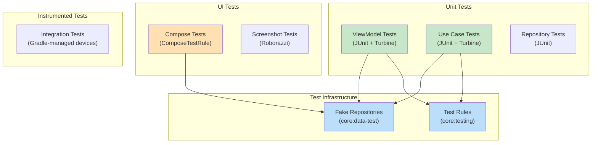

# Chapter 14 — Testing

## Overview

NiA has a comprehensive testing strategy: **unit tests** for ViewModels and use cases, **Compose UI tests** for screens, **fake repositories** for isolation, and **screenshot tests** (Roborazzi) for visual regression.

---

## Testing Strategy



---

## Test Infrastructure

### core:testing

Shared test utilities:

| Class | Purpose |
|-------|---------|
| `TestDispatcherRule` | JUnit rule that replaces `Dispatchers.Main` with `TestDispatcher` |
| `NiaTestRunner` | Custom test runner for instrumented tests |

### core:data-test

Fake repository implementations:

```kotlin
class TestTopicsRepository : TopicsRepository {
    private val topicsFlow = MutableSharedFlow<List<Topic>>()

    override fun getTopics(): Flow<List<Topic>> = topicsFlow
    override fun getTopic(id: String): Flow<Topic> =
        topicsFlow.map { it.first { topic -> topic.id == id } }

    fun sendTopics(topics: List<Topic>) {
        topicsFlow.tryEmit(topics)
    }

    override suspend fun syncWith(synchronizer: Synchronizer) = true
}
```

**Why fakes over mocks:**
- Fakes implement the real interface — they catch interface changes
- More readable test code — `repository.sendTopics(data)` vs `whenever(repo.getTopics()).thenReturn(...)`
- Reusable across all test classes
- No mock framework dependency

---

## Unit Testing ViewModels

```kotlin
class TopicViewModelTest {
    @get:Rule
    val dispatcherRule = TestDispatcherRule()

    private val userDataRepository = TestUserDataRepository()
    private val topicsRepository = TestTopicsRepository()
    private val userNewsResourceRepository = TestUserNewsResourceRepository()

    private lateinit var viewModel: TopicViewModel

    @Before
    fun setup() {
        viewModel = TopicViewModel(
            userDataRepository = userDataRepository,
            topicsRepository = topicsRepository,
            userNewsResourceRepository = userNewsResourceRepository,
            topicId = "test-topic",
        )
    }

    @Test
    fun topicUiState_whenInitialized_isLoading() {
        assertEquals(TopicUiState.Loading, viewModel.topicUiState.value)
    }

    @Test
    fun topicUiState_whenDataLoads_isSuccess() = runTest {
        topicsRepository.sendTopics(listOf(testTopic))
        userDataRepository.setFollowedTopicIds(setOf("test-topic"))

        viewModel.topicUiState.test {
            val state = awaitItem()
            assertTrue(state is TopicUiState.Success)
        }
    }

    @Test
    fun followTopic_updatesRepository() = runTest {
        viewModel.followTopicToggle(true)

        assertTrue(
            userDataRepository.isTopicFollowed("test-topic"),
        )
    }
}
```

**Key testing libraries:**
- `kotlinx.coroutines.test` — `runTest`, `TestDispatcher`
- `cashapp/turbine` — `.test { }` for `Flow` assertions
- `google/truth` or JUnit assertions

---

## Testing Use Cases

```kotlin
class GetFollowableTopicsUseCaseTest {
    private val topicsRepository = TestTopicsRepository()
    private val userDataRepository = TestUserDataRepository()

    val useCase = GetFollowableTopicsUseCase(
        topicsRepository = topicsRepository,
        userDataRepository = userDataRepository,
    )

    @Test
    fun topicsWithFollowState_areCorrectlyMapped() = runTest {
        topicsRepository.sendTopics(sampleTopics)
        userDataRepository.setFollowedTopicIds(setOf("topic-1"))

        useCase().test {
            val topics = awaitItem()
            assertEquals(true, topics.first { it.topic.id == "topic-1" }.isFollowed)
            assertEquals(false, topics.first { it.topic.id == "topic-2" }.isFollowed)
        }
    }
}
```

---

## Compose UI Testing

Screens are tested with `ComposeTestRule`:

```kotlin
class ForYouScreenTest {
    @get:Rule
    val composeTestRule = createComposeRule()

    @Test
    fun whenLoading_showsLoadingIndicator() {
        composeTestRule.setContent {
            ForYouScreen(
                feedState = NewsFeedUiState.Loading,
                onboardingUiState = OnboardingUiState.Loading,
                // ... provide all lambdas as no-ops
            )
        }

        composeTestRule.onNodeWithTag("loadingIndicator").assertIsDisplayed()
    }

    @Test
    fun whenSuccess_showsNewsFeed() {
        composeTestRule.setContent {
            ForYouScreen(
                feedState = NewsFeedUiState.Success(sampleResources),
                // ...
            )
        }

        composeTestRule.onNodeWithText("Sample Article Title").assertIsDisplayed()
    }
}
```

**Note:** Tests use `ComponentActivity` (not `MainActivity`) and the **stateless** screen composable — providing state directly rather than through a ViewModel.

---

## Screenshot Testing

NiA uses Roborazzi for screenshot tests:

```bash
# Generate reference screenshots
./gradlew updateRoborazziDemoDebug

# Verify screenshots match
./gradlew verifyRoborazziDemoDebug
```

Screenshot tests are generated by CI and should **not** be checked in from workstations.

---

## Flow Testing with Turbine

```kotlin
viewModel.feedState.test {
    // Skip initial Loading state
    assertEquals(NewsFeedUiState.Loading, awaitItem())

    // Emit data from fake repository
    repository.sendNewsResources(sampleResources)

    // Verify Success state
    val successState = awaitItem()
    assertTrue(successState is NewsFeedUiState.Success)
    assertEquals(3, (successState as NewsFeedUiState.Success).feed.size)

    cancelAndConsumeRemainingEvents()
}
```

---

## Running Tests

```bash
# Run all local tests (fast)
./gradlew testDemoDebug

# Run single test class
./gradlew testDemoDebug --tests "com.google.samples.apps.nowinandroid.feature.topic.impl.TopicViewModelTest"

# Run instrumented tests on emulator
./gradlew pixel6api31aospDebugAndroidTest

# Verify screenshot tests
./gradlew verifyRoborazziDemoDebug
```

---

## Summary

NiA's testing strategy uses fake repositories for isolation, Turbine for Flow assertions, and the stateless composable pattern for UI tests. No mocking frameworks needed.

## Key Takeaways

- Fake repositories implement real interfaces — type-safe, reusable
- `TestDispatcherRule` replaces `Dispatchers.Main` for ViewModel tests
- Turbine's `.test {}` makes Flow assertions readable
- UI tests use stateless composables with direct state injection
- Screenshot tests are CI-only

## Best Practices

- Create fakes for every repository interface in `core:data-test`
- Test ViewModels by controlling fake repository emissions
- Test Composables by providing known states to stateless variants
- Use `runTest` for all coroutine tests

## Common Mistakes

- **Using Mockito instead of fakes** — Fakes catch interface changes, mocks don't
- **Testing with real database** — Slow and flaky; use fakes
- **Forgetting `TestDispatcherRule`** — `viewModelScope` won't work correctly
- **Testing stateful composable** — Test the stateless variant for isolation
