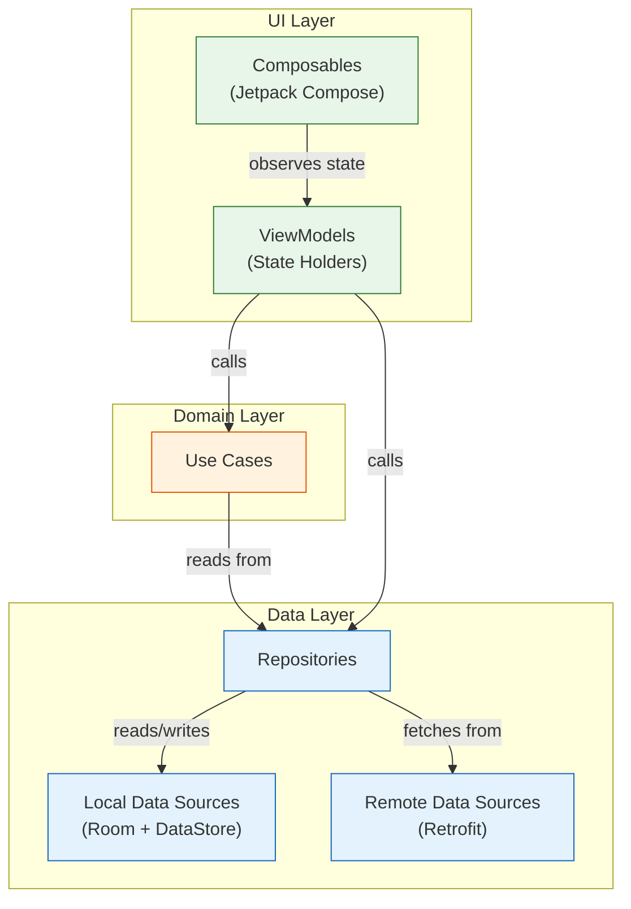
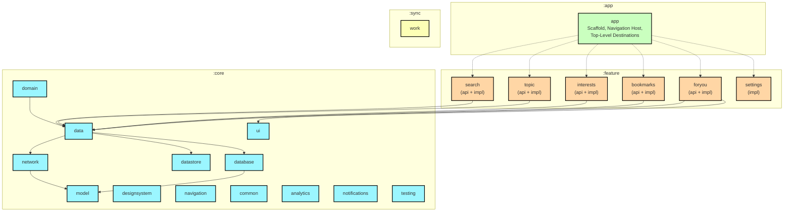
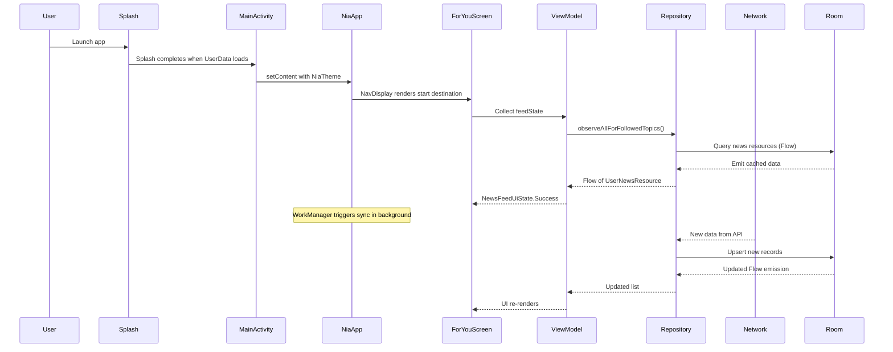
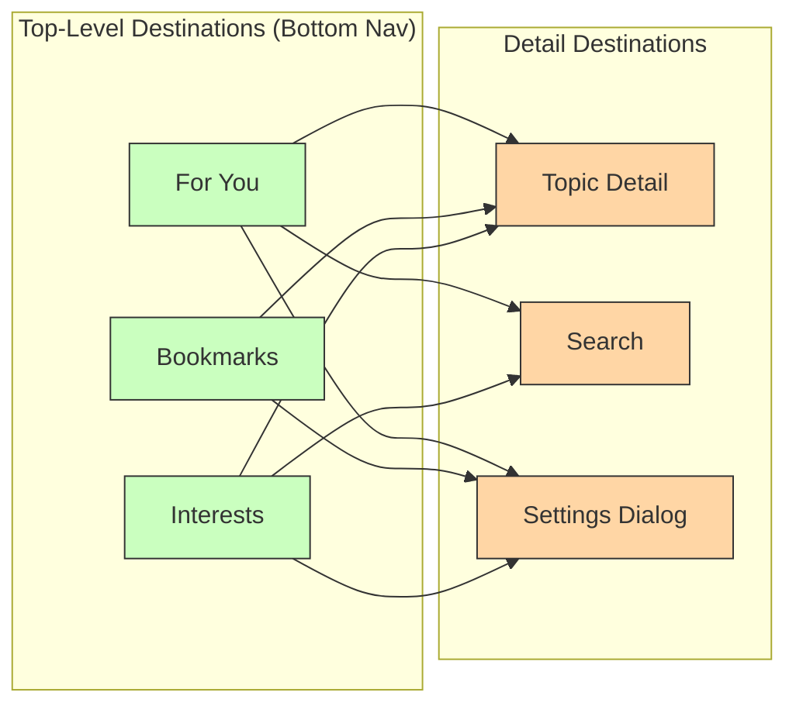

# Now in Android — Architecture Documentation

> **Complete engineering handbook** for understanding, extending, and building upon the Now in Android architecture.

---

## Introduction

Now in Android (NiA) is Google's official reference application demonstrating modern Android development best practices. It is a fully functional app that delivers news about Android development, built with Jetpack Compose, Kotlin, Hilt, Room, DataStore, WorkManager, Navigation 3, and Material 3.

This documentation explains **how the project works internally**, **why each architectural decision was made**, and **how a developer can extend the project** by adding new features.

---

## Architecture Overview

**Key principles:**

- **Unidirectional Data Flow (UDF)**: Events flow down, data flows up
- **Reactive streams**: All data exposed as Kotlin `Flow`
- **Offline-first**: Local storage is source of truth, network syncs in background
- **Feature modularization**: Each feature owns its UI, ViewModel, and navigation
- **Dependency inversion**: Upper layers depend on abstractions, not implementations

---

## High-Level Module Map

---

## Application Flow

---

## Navigation Flow

---

## Documentation Index

| # | Chapter | Description |
|---|---------|-------------|
| 1 | [Project Overview](01-project-overview.md) | Why this project exists, its goals, and architectural principles |
| 2 | [Project Structure](02-project-structure.md) | Every folder explained with dependency direction diagrams |
| 3 | [Module Architecture](03-module-architecture.md) | Deep dive into core, feature, and data modules |
| 4 | [Clean Architecture](04-clean-architecture.md) | Layers, repository pattern, data flow, and sequence diagrams |
| 5 | [UI Layer](05-ui-layer.md) | Compose architecture, ViewModel, state, events, and effects |
| 6 | [Domain Layer](06-domain-layer.md) | Use cases, business rules, threading, and testing |
| 7 | [Data Layer](07-data-layer.md) | Repository implementation, offline-first, sync strategy |
| 8 | [Navigation](08-navigation.md) | **Comprehensive** Navigation 3 guide — the most detailed chapter |
| 9 | [Feature Development Guide](09-feature-development-guide.md) | Step-by-step tutorial for adding new features |
| 10 | [State Management](10-state-management.md) | StateFlow, UI state modeling, sealed hierarchies |
| 11 | [Dependency Injection](11-dependency-injection.md) | Hilt modules, bindings, scopes, and testing DI |
| 12 | [Build Logic](12-build-logic.md) | Convention plugins, version catalog, composite builds |
| 13 | [Gradle Modules](13-gradle-modules.md) | Module dependencies, API vs implementation |
| 14 | [Testing](14-testing.md) | Unit tests, UI tests, fakes, Compose testing |
| 15 | [Best Practices](15-best-practices.md) | Architectural principles, common mistakes, scaling advice |
| — | [Architecture Diagrams](architecture-diagrams.md) | All diagrams in one place |

---

## Quick Reference

| Technology | Usage |
|---|---|
| **Kotlin** | Primary language |
| **Jetpack Compose** | UI toolkit (Material 3) |
| **Navigation 3** | Type-safe navigation with `NavKey`, `NavDisplay`, `entryProvider` |
| **Hilt** | Dependency injection |
| **Room** | Local database |
| **DataStore (Proto)** | User preferences |
| **Retrofit** | Network requests |
| **WorkManager** | Background sync |
| **Coroutines + Flow** | Async and reactive programming |
| **Kotlin Serialization** | Serialization of nav keys and network models |

---

*This documentation is based on the latest version of the [Now in Android](https://github.com/android/nowinandroid) repository.*
