# Architecture Diagrams

All architecture diagrams from the documentation, consolidated in one place.

---

## 1. Overall Architecture

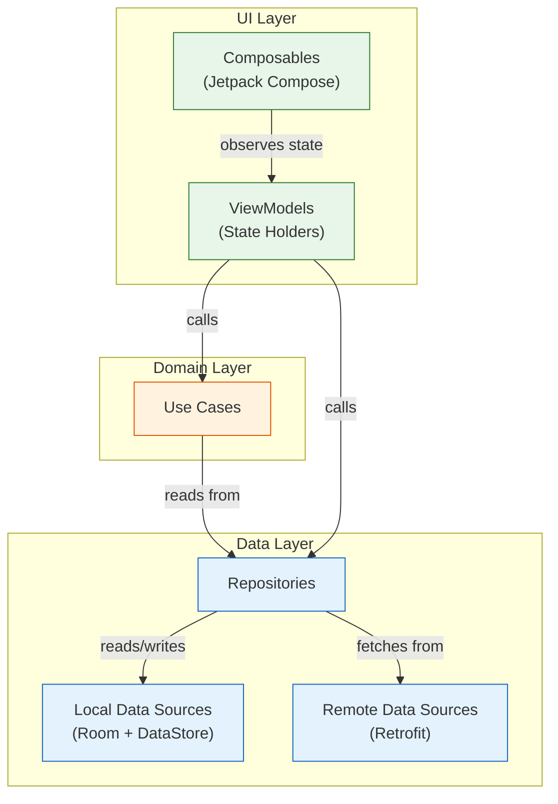

---

## 2. Module Dependency Graph

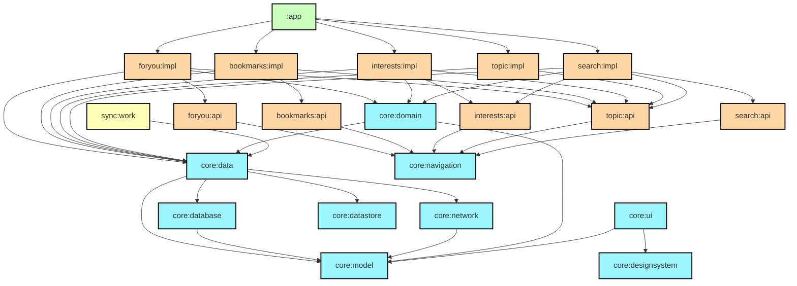

---

## 3. Navigation Graph

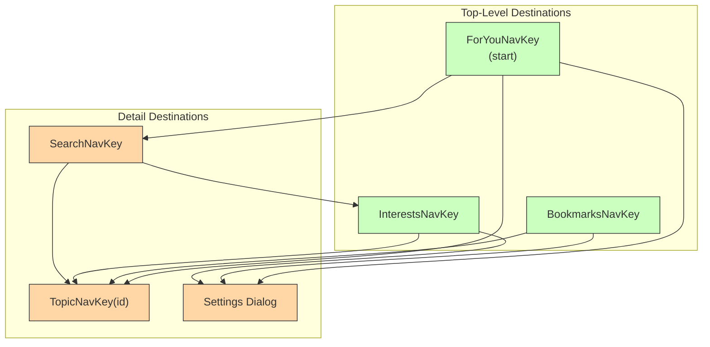

---

## 4. Data Flow: For You Screen

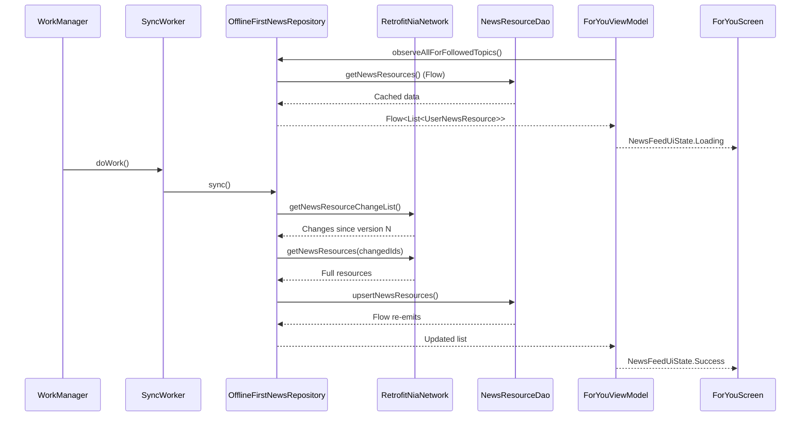

---

## 5. Sync Strategy

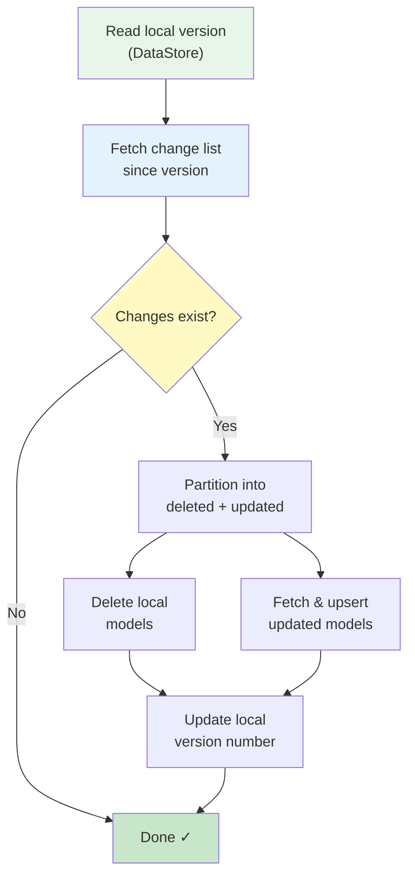

---

## 6. Unidirectional Data Flow

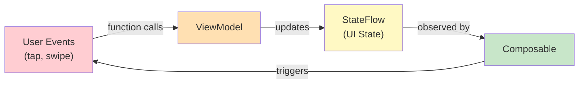

---

## 7. Repository Pattern

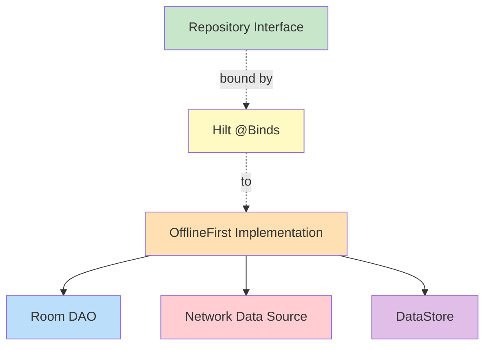

---

## 8. Data Model Mapping

```mermaid
graph LR
    NET_MODEL["NetworkNewsResource<br/>(API DTO)"]
    ENTITY["NewsResourceEntity<br/>(Room Entity)"]
    POPULATED["PopulatedNewsResource<br/>(Room Relation)"]
    MODEL["NewsResource<br/>(Public Model)"]
    USER_MODEL["UserNewsResource<br/>(Enriched)"]

    NET_MODEL -->|"asEntity()"| ENTITY
    ENTITY -->|"Room query"| POPULATED
    POPULATED -->|"asExternalModel()"| MODEL
    MODEL -->|"+ UserData"| USER_MODEL

    style NET_MODEL fill:#FFCDD2
    style ENTITY fill:#BBDEFB
    style POPULATED fill:#BBDEFB
    style MODEL fill:#C8E6C9
    style USER_MODEL fill:#FFF9C4
```

---

## 9. Feature Module Structure

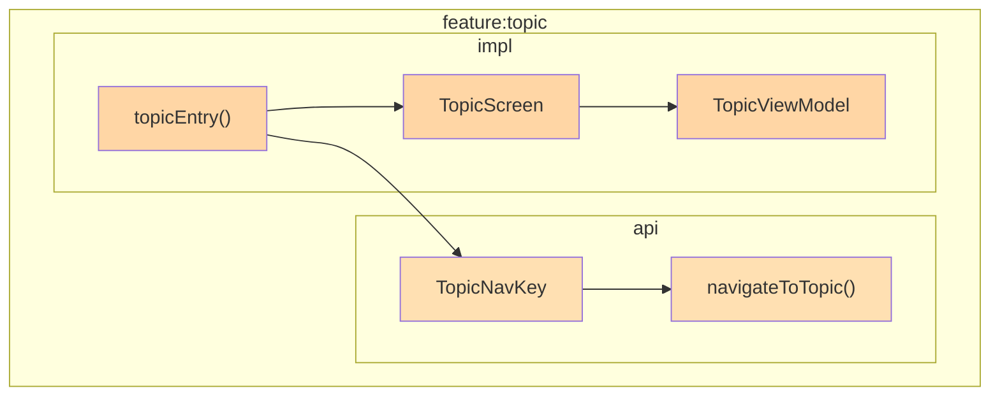

---

## 10. Back Stack Architecture

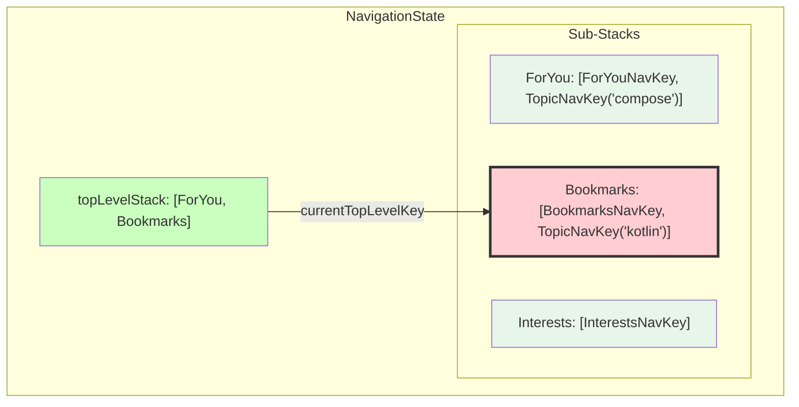

---

## 11. Build Parallelism

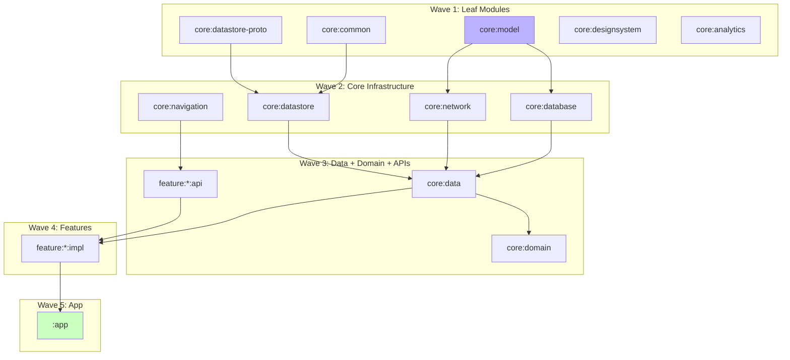

---

## 12. State Machine

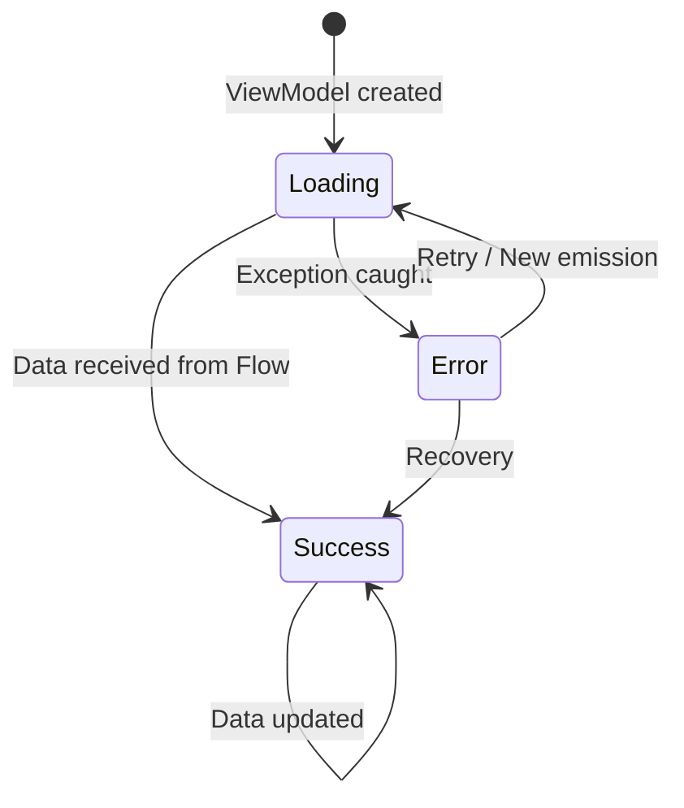

---

## 13. Hilt Dependency Graph

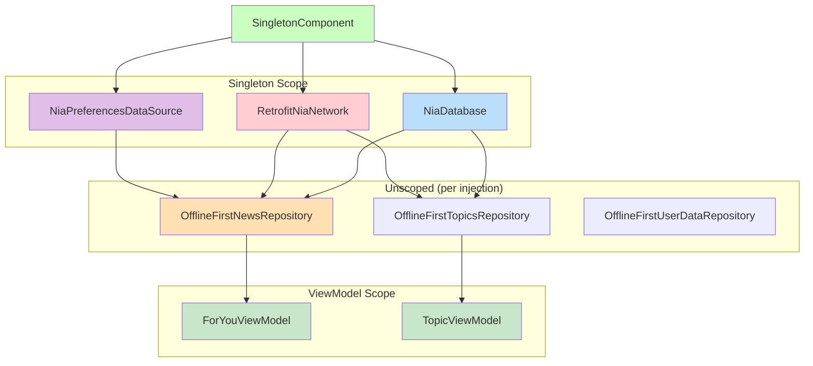

---

*All diagrams use Mermaid syntax and render in any Mermaid-compatible viewer (GitHub, GitLab, VS Code, etc.).*
